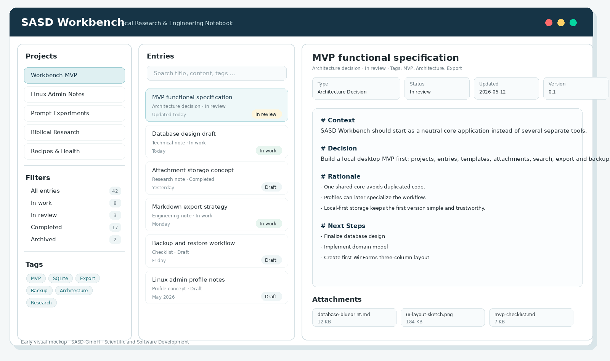

# SASD Workbench

**SASD Workbench** is a local, modular desktop application for structured project, research and engineering documentation.

The first version focuses on a robust offline core: projects, entries, templates, attachments, tags, search, export and backups. Later versions may add specialized profiles for lab work, software engineering, Linux administration, prompt experiments, biblical research, recipes and health-related documentation.

> Status: early concept / MVP planning phase  
> Planned first implementation: C# / .NET 8 / Windows Forms / SQLite

---

## Screenshot



*Early UI mockup for the planned desktop MVP. The final application may differ.*

---

## Project Goal

The goal of SASD Workbench is to provide a practical local tool for documenting structured work over time.

Typical use cases include:

- project journals
- experiments and observations
- software tests and bug analyses
- architecture decisions
- Linux administration notes
- prompt engineering experiments
- research notes
- recipe and food experiments
- long-running topic investigations

The application is intentionally designed as a **core platform** first. Specialized products or workflows should later be implemented through profiles, templates and modules instead of separate unrelated applications.

---

## Planned MVP Scope

Version 1.0 should provide:

- local desktop application
- SQLite-based local storage
- project management
- entry management
- entry types and status model
- collections
- tags
- templates
- attachment handling
- title and content search
- filters by project, type, status, collection and tag
- Markdown export
- optional HTML export
- backup and restore
- simple activity log

---

## Planned Architecture

The application should avoid a large monolithic UI file. Business logic should be separated from the Windows Forms frontend.

Planned solution structure:

```text
sasd-workbench/
  docs/
  src/
    SASD.Workbench.Domain/
    SASD.Workbench.Application/
    SASD.Workbench.Infrastructure/
    SASD.Workbench.WinForms/
  tests/
    SASD.Workbench.Tests/
```

Architecture principle:

```text
UI → Application Services → Repositories → SQLite / File Storage
```

---

## Planned Profiles

The core application should later support different profiles, for example:

| Profile | Purpose |
|---|---|
| General | General project and work documentation |
| LabBook | Experiments, protocols, measurements |
| Software / Engineering | ADRs, tests, bug analyses, releases |
| Linux Admin | Servers, changes, incidents, maintenance |
| Prompt Notebook | Prompts, model tests, result comparisons |
| Biblical Research | Topics, sources, arguments, open questions |
| Food & Health | Recipes, tolerance notes, blood values, diary entries |

The first MVP should not implement all specialized features. It should provide a strong foundation that can grow without architectural rewrites.

---

## Documentation

Planned documentation:

- requirements specification
- MVP functional specification
- technical design document
- database design
- user guide
- developer guide
- changelog
- release notes

---

## Non-Goals for Version 1

Version 1 is intentionally local and limited.

Not planned for V1:

- cloud synchronization
- mobile app
- multi-user/team mode
- regulatory electronic signatures
- medical diagnosis or therapy recommendations
- mandatory AI integration
- full plugin system
- complex laboratory data analysis

---

## License

This project is licensed under the MIT License. See [LICENSE](LICENSE).

---

## About SASD-GmbH

SASD-GmbH stands for **Scientific and Software Development**.

The project is intended as part of a broader SASD strategy to build practical, well-documented and maintainable tools for scientific, technical and software-oriented workflows.
