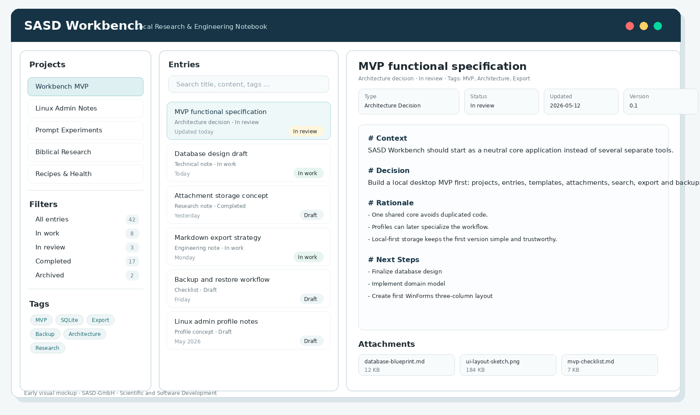

# SASD Workbench

**SASD Workbench** is a local, modular desktop application and shared codebase for structured project, research and engineering documentation.

The current development focuses on a robust offline core: projects, entries, templates, attachments, tags, collections, typed relations, search, export and backups. Later versions add cross-cutting capabilities such as research questions, sources, timelines, reusable resources, annotations, structured data and context snapshots. Specialized SASD Workbench applications can then build on the same core for lab work, software engineering, Linux administration, prompt experiments, biblical research, recipes and health-related documentation.

> Status: active early development / reusable core foundation  
> Current technical baseline: C# / .NET 10 / Windows Forms / SQLite

---

## Screenshot



*Early UI mockup. The current backend/core implementation is further advanced than this mockup and the final application may differ.*

---

## Project Goal

The goal of SASD Workbench is to provide a practical local tool and reusable platform for documenting structured work over time.

Typical use cases include:

- project journals
- experiments and observations
- research questions and hypotheses
- source and literature notes
- software tests and bug analyses
- architecture decisions
- Linux administration notes
- prompt engineering experiments
- research notes
- recipe and food experiments
- long-running topic investigations
- timelines and event-based documentation

The application is intentionally designed as a **core platform** first. Specialized products or workflows should later be implemented through profiles, templates, modules or dedicated hosts instead of separate unrelated codebases.

A central rule is:

> Fachprofile dürfen den Core fordern, aber nicht verformen.

Features discovered in specialized projects such as Health Research or Biblical Research are moved into the shared core only when they can be expressed as a neutral, reusable capability.

---

## V1 Core Scope

Version 1.0 is intended to provide:

- local desktop application
- SQLite-based local storage
- project management
- entry management
- entry types and status model
- collections, including multiple collections per entry
- tags
- templates
- controlled attachment handling
- typed entry relations
- title and content search
- filters by project, type, status, collection and tag
- Markdown project export
- validated backup and restore
- simple activity log

The current codebase already contains significant parts of this core and uses GitHub Actions plus an end-to-end smoke-test path to verify persistence and migrations.

---

## Cross-Cutting Capabilities

The common Workbench roadmap now explicitly includes reusable capabilities derived from multiple specialist notebooks:

- Timeline & Events
- Research Questions
- Observations & Hypotheses
- typed semantic Entry Relations
- Research Sources / References
- Context Snapshots
- Resource / Media Library with non-destructive annotations
- Structured Data Blocks, Measurements and Tables

These capabilities are deliberately generic. The common core does not contain medical, biblical, Linux-specific or other profile-specific interpretation.

---

## Architecture

The application avoids a large monolithic UI file. Business and domain logic are separated from the Windows Forms frontend.

Current solution structure:

```text
sasd-workbench/
  docs/
  src/
    SASD.Workbench.Domain/
    SASD.Workbench.Application/
    SASD.Workbench.Infrastructure/
    SASD.Workbench.WinForms/
  tests/
    SASD.Workbench.SmokeTests/
```

Architecture principle:

```text
UI → Application Services → Repositories → SQLite / File Storage
```

The Domain and Application layers must remain independent of Windows Forms and profile-specific UI decisions.

---

## Planned Profiles / Products

The shared core can later support different profiles or dedicated Workbench hosts, for example:

| Profile / Product | Purpose |
|---|---|
| General | General project and work documentation |
| Lab / Research | Experiments, protocols, measurements, sources |
| Software / Engineering | ADRs, tests, bug analyses, releases |
| Linux Admin | Servers, changes, incidents, maintenance |
| Prompt Research | Prompts, model tests, result comparisons |
| Biblical Research | Topics, sources, persons, events, arguments, open questions |
| Food & Health | Diary, measurements, observations, nutrition and context documentation |

The common Core provides primitives such as Entry, Collection, Relation, Timeline Event, Source, Resource and Measurement. Fachprofiles define what those primitives mean in their own domain.

---

## Documentation

Core project documentation:

- [010 – Lastenheft](docs/010_Lastenheft.md)
- [020 – Pflichtenheft MVP](docs/020_Pflichtenheft_MVP.md)
- [030 – Architektur](docs/030_Architektur_Dokument.md)
- [040 – Database Design](docs/040_Database_Design.md)
- [045 – Cross-Cutting Features](docs/045_Cross_Cutting_Features.md)
- [050 – Development Roadmap](docs/050_Development_Roadmap.md)
- [CHANGELOG](CHANGELOG.md)
- [Agent / repository instructions](AGENTS.md)

`045_Cross_Cutting_Features.md` is a design supplement to the four original foundation documents and captures reusable capabilities discovered in later specialist-project discussions.

---

## Non-Goals for Version 1

Version 1 is intentionally local and limited.

Not planned for V1:

- cloud synchronization
- mobile app
- multi-user/team mode
- regulatory electronic signatures
- medical diagnosis or therapy recommendations
- mandatory AI integration
- full plugin system
- graph database
- full literature-management replacement
- complex domain-specific laboratory or health analysis

---

## Development Principle

Before adding a new specialized feature to the shared Core, the project should ask:

1. Do at least two different profiles plausibly benefit from it?
2. Can it be named and modeled without domain-specific terminology?
3. Can the Core store and process it without making domain interpretations?
4. Can export, backup, migration and tests remain complete?

If not, the feature belongs in the specialist profile instead of the common Core.

---

## License

This project is licensed under the MIT License. See [LICENSE](LICENSE).

---

## About SASD-GmbH

SASD-GmbH stands for **Scientific and Software Development**.

The project is intended as part of a broader SASD strategy to build practical, well-documented and maintainable tools for scientific, technical and software-oriented workflows.
