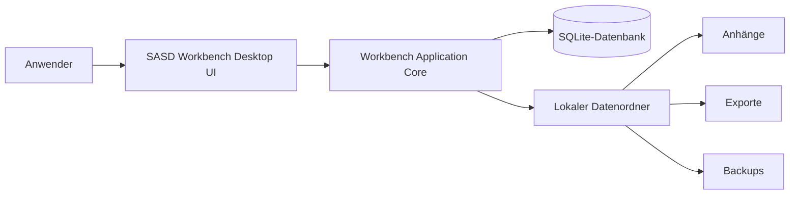
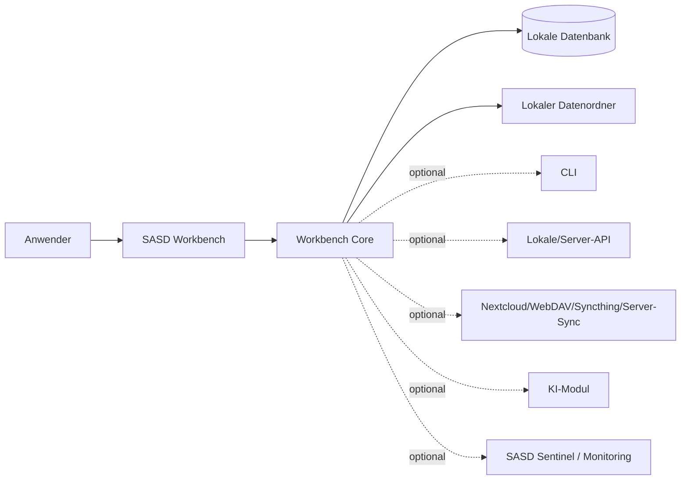
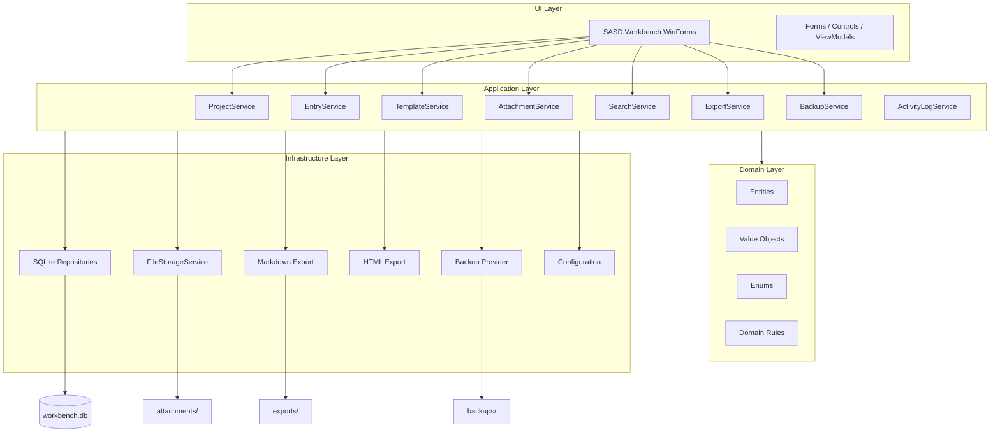
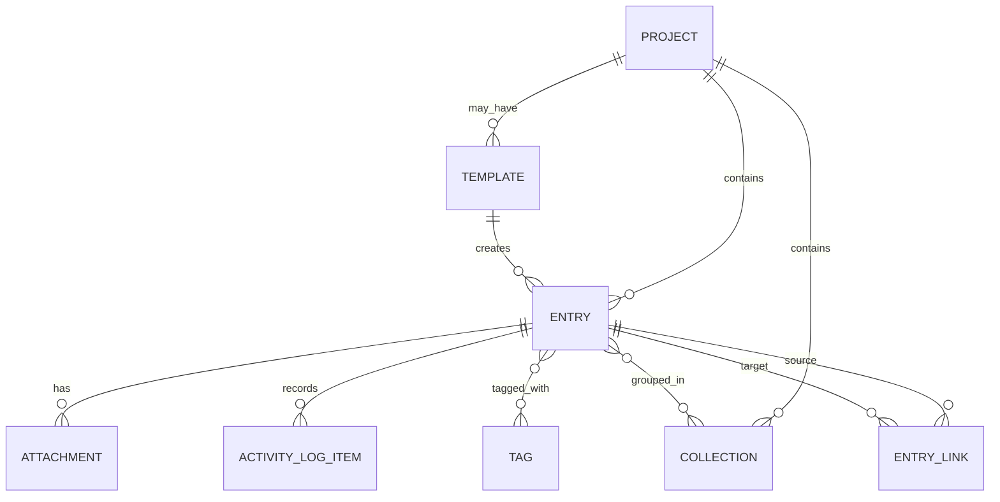

# Architektur-Dokument – SASD Workbench

**Projekt:** SASD Workbench  
**Komponente:** SASD Workbench Core / Desktop MVP  
**Dokumenttyp:** Architektur-Dokument / Technical Architecture Document  
**Organisation:** SASD-GmbH – Scientific and Software Development  
**Status:** Entwurf 1.0  
**Datum:** 2026-05-12  
**Sprache:** Deutsch  
**Zielplattform V1:** Lokale Desktop-Anwendung  
**Technologievorschlag V1:** C# / .NET 8 / Windows Forms / SQLite  
**Bezug:** Lastenheft `010_Lastenheft.md`, Pflichtenheft `020_Pflichtenheft_MVP.md`

---

## Inhaltsverzeichnis

1. [Zweck des Dokuments](#1-zweck-des-dokuments)
2. [Management Summary](#2-management-summary)
3. [Architekturziele](#3-architekturziele)
4. [Grundsatzentscheidung: Core zuerst, Profile später](#4-grundsatzentscheidung-core-zuerst-profile-später)
5. [Architekturprinzipien](#5-architekturprinzipien)
6. [Systemkontext](#6-systemkontext)
7. [Zielarchitektur im Überblick](#7-zielarchitektur-im-überblick)
8. [Versionierte Architektur-Roadmap](#8-versionierte-architektur-roadmap)
9. [Solution- und Repository-Struktur](#9-solution--und-repository-struktur)
10. [Schichtenarchitektur](#10-schichtenarchitektur)
11. [Modularchitektur](#11-modularchitektur)
12. [Domänenmodell](#12-domänenmodell)
13. [Datenhaltung und Persistenz](#13-datenhaltung-und-persistenz)
14. [Datei- und Anhangsarchitektur](#14-datei--und-anhangsarchitektur)
15. [UI-Architektur](#15-ui-architektur)
16. [Vorlagen- und Profilarchitektur](#16-vorlagen--und-profilarchitektur)
17. [Such- und Filterarchitektur](#17-such--und-filterarchitektur)
18. [Export-, Import- und Backup-Architektur](#18-export--import--und-backup-architektur)
19. [Activity Log, Historie und Audit-Konzept](#19-activity-log-historie-und-audit-konzept)
20. [Sicherheits-, Datenschutz- und Compliance-Architektur](#20-sicherheits--datenschutz--und-compliance-architektur)
21. [Erweiterbarkeit und spätere Produktfamilie](#21-erweiterbarkeit-und-spätere-produktfamilie)
22. [Automatisierung, CLI, API und Script-Integration](#22-automatisierung-cli-api-und-script-integration)
23. [Fehlerbehandlung, Logging und Diagnose](#23-fehlerbehandlung-logging-und-diagnose)
24. [Testarchitektur](#24-testarchitektur)
25. [Build-, Release- und Dokumentationsarchitektur](#25-build--release--und-dokumentationsarchitektur)
26. [Funktional-architektonische Versionsplanung](#26-funktional-architektonische-versionsplanung)
27. [Abnahmekriterien aus Architektursicht](#27-abnahmekriterien-aus-architektursicht)
28. [Architekturentscheidungen / ADR-Kandidaten](#28-architekturentscheidungen--adr-kandidaten)
29. [Risiken und Gegenmaßnahmen](#29-risiken-und-gegenmaßnahmen)
30. [Offene Architekturfragen](#30-offene-architekturfragen)
31. [Empfohlene Entwicklungsreihenfolge](#31-empfohlene-entwicklungsreihenfolge)
32. [Anhang A: Ziel-Dateistruktur](#32-anhang-a-ziel-dateistruktur)
33. [Anhang B: Beispielhafte Interfaces](#33-anhang-b-beispielhafte-interfaces)
34. [Anhang C: Beispielhafte Datenbanktabellen](#34-anhang-c-beispielhafte-datenbanktabellen)
35. [Anhang D: Architektur-Checkliste](#35-anhang-d-architektur-checkliste)
36. [Zusammenfassung](#36-zusammenfassung)

---

## 1. Zweck des Dokuments

Dieses Architektur-Dokument beschreibt, wie die **SASD Workbench** technisch aufgebaut werden soll. Es überführt die Anforderungen aus Lastenheft und Pflichtenheft in eine konkrete, aber noch ausreichend flexible technische Zielarchitektur.

Das Dokument beantwortet insbesondere folgende Fragen:

- Welche grundlegende Architektur soll die SASD Workbench erhalten?
- Welche Schichten, Module und Kernobjekte werden benötigt?
- Wie werden Projekte, Einträge, Vorlagen, Anhänge, Tags, Collections und Exporte technisch organisiert?
- Wie kann die Anwendung klein starten, ohne spätere Profile und Produkte zu blockieren?
- Welche Funktionen gehören in welche Version?
- Welche Entscheidungen müssen vor der Implementierung bewusst getroffen werden?

Das Architektur-Dokument richtet sich an Entwickler, spätere Maintainer, technische Reviewer und an SASD selbst als Grundlage für eine kontrollierte Umsetzung.

---

## 2. Management Summary

Die SASD Workbench wird als **lokale, modulare Desktop-Anwendung** geplant. Sie soll zunächst als Windows-Desktop-App mit C#, .NET 8, Windows Forms und SQLite umgesetzt werden. Die erste Version ist bewusst lokal, offlinefähig und einzelplatzorientiert.

Die zentrale Architekturentscheidung lautet:

> **SASD Workbench Core zuerst entwickeln; fachliche Produkte später über Profile, Vorlagen und Module ableiten.**

Die Anwendung soll nicht als starres Spezialprogramm für Labor, Rezepte, Bibelstudium oder Linux-Administration gebaut werden. Stattdessen entsteht ein neutraler Kern, der allgemeine Arbeitsobjekte verwaltet:

- Projekte,
- Collections / Sammlungen,
- Einträge,
- Eintragstypen,
- Status,
- Tags,
- Vorlagen,
- Anhänge,
- Querverweise,
- Activity Log,
- Export,
- Backup.

Fachlichkeit entsteht zunächst über Vorlagen. Später können daraus Profile wie **LabBook**, **Software/Engineering**, **Linux Admin Notebook**, **Prompt Notebook**, **Biblical Research Notebook**, **Recipe** und **Food & Health** entstehen.

Die Architektur folgt einer klaren Schichtung:

```text
WinForms UI
  ↓
Application Services / Use Cases
  ↓
Domain Model
  ↓
Infrastructure: SQLite, File Storage, Export, Backup
```

Wichtig ist, dass der Kern der Anwendung nicht in `Form1.cs` verschwindet. UI, Geschäftslogik, Datenzugriff und Dateisystemzugriffe müssen sauber getrennt werden.

---

## 3. Architekturziele

### 3.1 Schnell nutzbarer lokaler MVP

Die erste produktiv nutzbare Version soll möglichst schnell entstehen. Das bedeutet:

- keine Cloud-Abhängigkeit,
- keine Serverinstallation,
- keine komplexe Benutzerverwaltung,
- keine Mobile-App,
- keine regulatorische Spezialfunktionalität,
- keine zu frühe Plugin-Architektur.

V1 soll dennoch sauber genug sein, um später erweitert zu werden.

### 3.2 Erweiterbarkeit ohne spätere Kern-Neuentwicklung

Die Anwendung muss so entworfen werden, dass spätere Profile nicht zu einer kompletten Neuentwicklung führen. Deshalb wird ein allgemeines `Entry`-Modell verwendet, statt für jedes Fachgebiet eigene Haupttabellen und eigene Oberflächen zu entwickeln.

### 3.3 Datenhoheit und Portabilität

Die Daten liegen lokal beim Anwender. Export nach Markdown, HTML, später PDF und ZIP ist ein Kernziel. Der Anwender darf nicht in einem proprietären Format gefangen sein.

### 3.4 Wartbarkeit

Der Code soll verständlich, kommentiert und modular sein. Besonders wichtig:

- XML-Kommentare für öffentliche C#-Klassen und Methoden,
- klare Projektstruktur,
- keine Geschäftslogik in UI-Eventhandlern,
- testbare Services,
- nachvollziehbare Datenbankzugriffe.

### 3.5 Sicherheit gegen Datenverlust

Da die Anwendung lokal arbeitet, sind Backup, Restore, kontrollierte Anhangsablage und Rückfragen bei Löschaktionen architektonisch wichtig.

### 3.6 Spätere Professionalisierung vorbereiten

Funktionen wie Versionshistorie, Audit Trail, Signieren, Verschlüsselung, Sync, CLI, API und KI-Unterstützung sollen nicht in V1 umgesetzt werden, aber die Architektur soll sie nicht verhindern.

---

## 4. Grundsatzentscheidung: Core zuerst, Profile später

### 4.1 Entscheidung

Die SASD Workbench wird zuerst als neutraler **Core** entwickelt. Dieser Core ist keine Labor-App, keine Rezept-App, keine Bibel-App und kein Linux-Admin-Tool im engeren Sinn.

Der Core verwaltet allgemeine Arbeitsobjekte. Spätere fachliche Produkte entstehen durch:

- Profile,
- Vorlagen,
- Eintragstypen,
- Statusmodelle,
- Module,
- Exporte,
- spezialisierte UI-Ansichten.

### 4.2 Begründung

Die besprochenen Nutzungsszenarien teilen viele Funktionen:

| Funktion | Labor | Software | Linux Admin | Prompt | Bibel-Research | Rezepte / Health |
|---|---:|---:|---:|---:|---:|---:|
| Projekte | ja | ja | ja | ja | ja | ja |
| Einträge | ja | ja | ja | ja | ja | ja |
| Vorlagen | ja | ja | ja | ja | ja | ja |
| Anhänge | ja | ja | ja | ja | ja | ja |
| Tags | ja | ja | ja | ja | ja | ja |
| Suche | ja | ja | ja | ja | ja | ja |
| Export | ja | ja | ja | ja | ja | ja |
| Backup | ja | ja | ja | ja | ja | ja |
| Historie | ja | ja | ja | ja | ja | ja |
| Querverweise | ja | ja | ja | ja | ja | ja |

Würden diese Bereiche als getrennte Anwendungen entwickelt, müssten dieselben Grundfunktionen mehrfach gebaut, getestet und gepflegt werden.

### 4.3 Konsequenz für die Architektur

Das zentrale Domänenobjekt heißt **Entry**. Ein Entry besitzt einen Typ. Der Typ beschreibt, wie der Eintrag fachlich interpretiert wird.

Beispiele:

```text
Entry Type = Experiment
Entry Type = Fehleranalyse
Entry Type = Linux-Wartungsprotokoll
Entry Type = Prompt-Test
Entry Type = Bibel-Thema
Entry Type = Rezeptversuch
Entry Type = Blutwertnotiz
```

Der Kern muss nicht wissen, wie ein Blutwert medizinisch zu bewerten ist oder wie ein Laborgerät kalibriert wird. Er muss nur Einträge, Metadaten, Anhänge, Querverweise, Vorlagen und Exporte zuverlässig verwalten.

---

## 5. Architekturprinzipien

### 5.1 Lokal zuerst

V1 ist eine lokale Einzelplatzanwendung. Alle Daten liegen auf dem Rechner des Anwenders.

Vorteile:

- einfacher Einstieg,
- keine Serverabhängigkeit,
- bessere Datenkontrolle,
- weniger Datenschutzrisiken,
- einfacher Prototyp.

### 5.2 Offlinefähigkeit

Die Anwendung muss ohne Internet funktionieren. Internetzugriff darf in V1 nicht Voraussetzung sein.

### 5.3 Klare Schichten

Die Architektur trennt:

- Benutzeroberfläche,
- Anwendungslogik,
- Domänenmodell,
- Datenbankzugriff,
- Dateispeicher,
- Export,
- Backup.

### 5.4 Keine Geschäftslogik im UI

Windows Forms darf nicht zum Ort der eigentlichen Anwendung werden. Button-Click-Events sollen nur Eingaben einsammeln und Application Services aufrufen.

### 5.5 Erweiterbar, aber nicht überabstrahiert

V1 soll nicht mit einem vollständigen Plugin-System überfrachtet werden. Trotzdem werden klare Interfaces und Services vorbereitet.

### 5.6 Daten exportierbar halten

Markdown-Export ist früh Pflicht. Später folgen HTML, PDF, ZIP-Projektarchiv, Obsidian- und DokuWiki-kompatible Exporte.

### 5.7 Anhänge kontrolliert verwalten

Anhänge werden nicht nur verlinkt, sondern in den Workbench-Datenbereich kopiert. Dadurch bleiben Einträge stabil, auch wenn Originaldateien verschoben oder gelöscht werden.

### 5.8 Sicherheit nicht behaupten, wenn sie nicht vorhanden ist

V1 ist keine verschlüsselte Hochsicherheitsanwendung und keine regulatorisch validierte Laborsoftware. Das muss dokumentiert werden.

### 5.9 Schrittweise Professionalisierung

Versionshistorie, Audit Trail, Review, Signatur, Verschlüsselung und Sync werden bewusst später eingeführt.

---

## 6. Systemkontext

### 6.1 Kontext V1



V1 hat keine verpflichtenden externen Systeme.

### 6.2 Kontext späterer Versionen



Spätere Systeme sind optional. Sie dürfen V1 nicht komplizieren.

---

## 7. Zielarchitektur im Überblick

### 7.1 Grobübersicht



### 7.2 Zentrale Bausteine

| Baustein | Aufgabe | Ab Version |
|---|---|---:|
| Domain Model | Kernobjekte und Regeln | 0.1 |
| Application Services | Anwendungsfälle kapseln | 0.1 |
| SQLite Repositories | Persistenz strukturierter Daten | 0.1 |
| FileStorageService | Anhänge verwalten | 0.5 |
| TemplateService | Vorlagen anwenden | 0.5 |
| SearchService | Suche und Filter | 0.5 |
| ExportService | Markdown/HTML/PDF/ZIP | 1.0 / 2.0 |
| BackupService | Backup und Restore | 1.0 |
| ActivityLogService | Aktivitäten protokollieren | 1.0 |
| ProfileService | Fachprofile verwalten | 3.0 |
| HistoryService | Versionshistorie | 2.0 |
| AuditService | manipulationsärmerer Audit Trail | 4.0 |
| SyncService | Synchronisation | 4.0 |
| AiAssistantService | KI-Unterstützung | 4.0 |

---

## 8. Versionierte Architektur-Roadmap

### 8.1 Version 0.1 – Technischer Prototyp

Architekturziel: Die Schichten und technische Grundstruktur funktionieren.

Umsetzung:

- .NET-Solution anlegen,
- Projekte für Domain, Application, Infrastructure, WinForms und Tests,
- SQLite-Datenbank erzeugen,
- erste Tabellen für Projekte und Einträge,
- erste Repositories,
- minimaler ProjectService und EntryService,
- einfache UI zum Anlegen und Anzeigen.

Noch nicht enthalten:

- vollständige Anhangsverwaltung,
- Export,
- Backup,
- Profile,
- komplexe Suche.

### 8.2 Version 0.5 – Interner MVP

Architekturziel: Die Kernobjekte sind nutzbar.

Umsetzung:

- Projektverwaltung,
- Eintragsverwaltung,
- Eintragstypen,
- Status,
- Tags,
- einfache Suche,
- erste Vorlagen,
- erste Anhangsverwaltung,
- Drei-Bereich-UI als Grundstruktur.

### 8.3 Version 1.0 – Lokaler Desktop-MVP

Architekturziel: Stabiler Einzelplatz-MVP.

Umsetzung:

- Collections,
- Vorlagenbibliothek,
- stabile Anhangsverwaltung,
- Suche und Filter,
- Markdown-Export,
- optional HTML-Export,
- Backup und Restore,
- Activity Log Light,
- Querverweise vorbereitet.

### 8.4 Version 1.1 – Komfort und Qualität

Architekturziel: V1 wird produktiver und robuster.

Umsetzung:

- Attachment Templates,
- Checklisten,
- Linkliste pro Eintrag,
- verbesserte Fehlerbehandlung,
- Anwenderhandbuch,
- klarere Konfiguration,
- bessere Exportoptionen.

### 8.5 Version 2.0 – Journal, PDF, Historie

Architekturziel: Die App wird ein echtes Arbeitsjournal.

Umsetzung:

- PDF-Export,
- automatisches Journal,
- Versionshistorie,
- erweiterter Activity Log,
- Timer und Zeitstempel,
- Ressourcen-Bibliothek,
- CSV-Import und Tabellenvorschau,
- Projekt-Export als ZIP,
- Markdown-Import,
- Dashboard.

### 8.6 Version 3.0 – Fachprofile

Architekturziel: Die Workbench wird zur Produktfamilie.

Umsetzung:

- ProfileService,
- Profildefinitionen,
- profilabhängige Begriffe,
- profilabhängige Templates,
- profilabhängige Eintragstypen,
- LabBook-, Engineering-, Linux-Admin-, Prompt-, Biblical-Research-, Recipe- und Food-&-Health-Profil.

### 8.7 Version 4.0 – Profi-Funktionen

Architekturziel: Team-, Sicherheits-, Sync- und Automatisierungsfähigkeit.

Umsetzung optional:

- Benutzer und Rollen,
- Review-Workflow,
- Signieren/Freigeben,
- manipulationsärmerer Audit Trail,
- Verschlüsselung,
- Synchronisation,
- CLI/API,
- KI-Unterstützung,
- Plugin- oder Modul-System.

---

## 9. Solution- und Repository-Struktur

### 9.1 Zielstruktur

```text
sasd-workbench/
  README.md
  LICENSE
  CHANGELOG.md
  .gitignore
  .editorconfig

  docs/
    010_Lastenheft.md
    020_Pflichtenheft_MVP.md
    030_Architektur_Dokument.md
    040_Database_Design.md
    050_User_Guide.md
    060_Developer_Guide.md
    adr/
      ADR-001-Core-First.md
      ADR-002-Local-First-SQLite.md
      ADR-003-WinForms-MVP.md

  src/
    SASD.Workbench.Domain/
      Entities/
      ValueObjects/
      Enums/
      Services/

    SASD.Workbench.Application/
      Interfaces/
      Services/
      UseCases/
      DTOs/
      Results/

    SASD.Workbench.Infrastructure/
      Database/
      Repositories/
      FileStorage/
      Export/
      Backup/
      Configuration/
      Logging/

    SASD.Workbench.WinForms/
      Forms/
      Controls/
      ViewModels/
      Presenters/
      Resources/

  tests/
    SASD.Workbench.Domain.Tests/
    SASD.Workbench.Application.Tests/
    SASD.Workbench.Infrastructure.Tests/
```

### 9.2 Begründung

Diese Struktur trennt klar:

- fachliche Kernlogik,
- Anwendungsfälle,
- Infrastruktur,
- Benutzeroberfläche,
- Tests,
- Dokumentation.

Dadurch kann später eine andere Oberfläche ergänzt werden, z. B. WPF, Avalonia, Web oder CLI, ohne die Domäne neu zu schreiben.

### 9.3 Abhängigkeitsrichtung

```text
WinForms → Application → Domain
Infrastructure → Application/Domain Interfaces
Tests → alle getesteten Projekte
```

Die Domain-Schicht darf keine Abhängigkeit auf UI, SQLite oder Dateisystem haben.

---

## 10. Schichtenarchitektur

## 10.1 Domain Layer

### Aufgabe

Die Domain-Schicht beschreibt die fachlichen Kernobjekte der SASD Workbench.

Sie enthält:

- Entities,
- Value Objects,
- Enums,
- einfache fachliche Regeln,
- keine UI,
- keinen SQLite-Code,
- keine Dateisystemzugriffe.

### Beispiele

```text
Project
Collection
Entry
Template
Attachment
Tag
EntryLink
ActivityLogItem
```

### Regeln

- Ein Projekt benötigt einen Namen.
- Ein Eintrag benötigt ein Projekt und einen Titel.
- Ein Anhang gehört zu einem Eintrag.
- Ein EntryLink verbindet zwei Einträge.
- Statuswerte müssen aus dem bekannten Statusmodell stammen.

### Warum wichtig?

Die Domain bleibt dadurch unabhängig von der Oberfläche. Spätere Oberflächen können dieselbe Logik nutzen.

---

## 10.2 Application Layer

### Aufgabe

Die Application-Schicht enthält die Anwendungsfälle. Sie koordiniert Domänenobjekte, Repositories, FileStorage, Export, Backup und Activity Log.

### Typische Services

```text
ProjectService
EntryService
CollectionService
TemplateService
AttachmentService
SearchService
ExportService
BackupService
ActivityLogService
ProfileService
```

### Beispiel: Eintrag aus Vorlage erzeugen

Der `EntryService` oder `TemplateService` führt aus:

1. Vorlage laden,
2. neuen Entry erzeugen,
3. Inhalt aus Vorlage kopieren,
4. EntryType und Status setzen,
5. Entry speichern,
6. ActivityLog-Eintrag erzeugen,
7. Ergebnis an UI zurückgeben.

### Ergebnisobjekte

Services sollten nicht einfach Exceptions bis in die UI werfen. Sinnvoll sind Result-Typen, z. B.:

```text
OperationResult
OperationResult<T>
ValidationResult
```

---

## 10.3 Infrastructure Layer

### Aufgabe

Die Infrastructure-Schicht kapselt technische Details.

Enthält:

- SQLite-Verbindung,
- Datenbankmigrationen,
- Repository-Implementierungen,
- Dateispeicher,
- Exporter,
- Backup/Restore,
- Konfiguration,
- Logging.

### Regel

Alle technischen Implementierungen müssen austauschbar bleiben. Der Application Layer sollte gegen Interfaces arbeiten.

Beispiel:

```text
IEntryRepository → SqliteEntryRepository
IFileStorageService → LocalFileStorageService
IExportService → MarkdownExportService / HtmlExportService / PdfExportService
```

---

## 10.4 UI Layer

### Aufgabe

Die UI-Schicht stellt die Windows-Forms-Oberfläche bereit.

Sie enthält:

- Forms,
- Controls,
- ViewModels oder Presenters,
- Dialoge,
- UI-spezifische Validierung,
- keine SQL-Statements,
- keine direkte Dateispeicherlogik.

### Regel

Button-Click-Events dürfen keine komplexe Logik enthalten.

Schlecht:

```text
Button_Click → SQL ausführen → Datei kopieren → Markdown erzeugen → UI aktualisieren
```

Gut:

```text
Button_Click → Application Service aufrufen → Ergebnis anzeigen
```

---

## 10.5 Tests

Tests werden auf mehrere Ebenen verteilt:

- Domain Tests,
- Application Tests,
- Infrastructure Integration Tests,
- manuelle UI-Tests.

---

## 11. Modularchitektur

Die SASD Workbench wird in fachlich-technische Module aufgeteilt. Module sind in V1 noch keine dynamisch ladbaren Plugins, sondern klar getrennte Bereiche innerhalb der Anwendung.

### 11.1 Project Module

Verantwortlich für:

- Projekt anlegen,
- Projekt bearbeiten,
- Projekt archivieren,
- Projekt löschen,
- Projektstatus,
- Projektprofil später.

### 11.2 Entry Module

Verantwortlich für:

- Einträge anlegen,
- Einträge bearbeiten,
- Einträge speichern,
- Einträge duplizieren,
- Einträge archivieren/löschen,
- EntryType,
- Status,
- Inhalt.

### 11.3 Collection Module

Verantwortlich für:

- Collections erstellen,
- Collections bearbeiten,
- Einträge zuordnen,
- nach Collections filtern,
- spätere verschachtelte Collections.

### 11.4 Tag Module

Verantwortlich für:

- Tags erstellen,
- Tags Einträgen zuordnen,
- Tags entfernen,
- Tag-Filter.

### 11.5 Template Module

Verantwortlich für:

- Vorlagen laden,
- Vorlagen anzeigen,
- Einträge aus Vorlagen erzeugen,
- spätere Vorlagenbearbeitung,
- spätere profilabhängige Vorlagen.

### 11.6 Attachment Module

Verantwortlich für:

- Datei hinzufügen,
- Datei in Datenordner kopieren,
- Datei öffnen,
- Datei im Dateimanager anzeigen,
- Anhang entfernen,
- Kommentar zum Anhang,
- spätere Attachment Templates.

### 11.7 Search Module

Verantwortlich für:

- Volltext-/Textsuche,
- Titel-/Inhaltssuche,
- Filter nach Projekt, Collection, Typ, Status, Tag,
- später SQLite FTS.

### 11.8 Export Module

Verantwortlich für:

- Markdown-Export,
- HTML-Export,
- später PDF,
- später ZIP-Projektarchiv,
- später Obsidian/DokuWiki.

### 11.9 Backup Module

Verantwortlich für:

- Backup erstellen,
- Restore durchführen,
- Datenbank und Anhänge konsistent sichern,
- Backup-Protokoll.

### 11.10 Activity Module

Verantwortlich für:

- wichtige Aktionen protokollieren,
- Eintragsaktivitäten anzeigen,
- Projektaktivitäten anzeigen,
- später Historie/Audit.

### 11.11 Profile Module

Ab Version 3.0:

- Profile verwalten,
- Begriffe je Profil,
- Eintragstypen je Profil,
- Statusmodelle je Profil,
- Templates je Profil.

---

## 12. Domänenmodell

### 12.1 Entity-Übersicht



### 12.2 Project

Ein Projekt ist der oberste organisatorische Container.

Felder:

- `Id`,
- `Name`,
- `Description`,
- `Status`,
- `ProfileKey` optional,
- `CreatedAtUtc`,
- `UpdatedAtUtc`,
- `ArchivedAtUtc` optional.

### 12.3 Collection

Eine Collection gruppiert Einträge innerhalb eines Projekts.

Felder:

- `Id`,
- `ProjectId`,
- `ParentCollectionId` optional ab später,
- `Name`,
- `Description`,
- `SortOrder`,
- `CreatedAtUtc`,
- `UpdatedAtUtc`.

### 12.4 Entry

Der Entry ist das zentrale Arbeitsobjekt.

Felder:

- `Id`,
- `ProjectId`,
- `EntryTypeKey`,
- `StatusKey`,
- `Title`,
- `Content`,
- `Summary` optional,
- `CreatedAtUtc`,
- `UpdatedAtUtc`,
- `CreatedBy`,
- `UpdatedBy`,
- `Version`,
- `IsArchived`,
- `DeletedAtUtc` optional.

### 12.5 EntryType

Ein EntryType beschreibt die fachliche Bedeutung eines Eintrags.

V1 kann EntryTypes zunächst als Code-/Konfigurationswerte halten. Später können sie in der Datenbank oder in Profildefinitionen verwaltet werden.

Beispiele:

- `general-note`,
- `experiment`,
- `research-note`,
- `meeting-note`,
- `sticky`,
- `bug-analysis`,
- `architecture-decision`,
- `prompt-test`,
- `linux-admin-note`,
- `recipe-experiment`,
- `biblical-research-topic`.

### 12.6 EntryStatus

Status beschreibt den Lebenszyklus.

Standardstatus:

- Entwurf,
- Geplant,
- In Arbeit,
- In Prüfung,
- Abgeschlossen,
- Zurückgestellt,
- Abgebrochen,
- Archiviert.

Später:

- Signiert,
- Freigegeben,
- Gesperrt.

### 12.7 Template

Eine Template-Entity beschreibt eine Vorlage.

Felder:

- `Id`,
- `Name`,
- `Description`,
- `EntryTypeKey`,
- `ProfileKey` optional,
- `Content`,
- `IsSystemTemplate`,
- `CreatedAtUtc`,
- `UpdatedAtUtc`.

Wichtig: Beim Erstellen eines Eintrags aus einer Vorlage wird der Inhalt kopiert. Der Entry bleibt danach unabhängig von der Vorlage.

### 12.8 Attachment

Ein Attachment beschreibt eine Datei, die zu einem Entry gehört.

Felder:

- `Id`,
- `EntryId`,
- `OriginalFileName`,
- `StoredFileName`,
- `RelativePath`,
- `MimeType` optional,
- `FileSizeBytes`,
- `Sha256Hash` optional,
- `Comment`,
- `CreatedAtUtc`,
- `RemovedAtUtc` optional.

### 12.9 Tag

Ein Tag ist ein freies Schlagwort.

Felder:

- `Id`,
- `Name`,
- `NormalizedName`,
- `CreatedAtUtc`.

### 12.10 EntryLink

Ein EntryLink verbindet zwei Einträge.

Felder:

- `Id`,
- `SourceEntryId`,
- `TargetEntryId`,
- `RelationType`,
- `Comment`,
- `CreatedAtUtc`.

Relationen:

- basiert auf,
- bestätigt,
- widerspricht,
- ersetzt,
- gehört zu,
- verwendet,
- vergleicht mit,
- Wiederholung von.

### 12.11 ActivityLogItem

Ein ActivityLogItem protokolliert wichtige Aktionen.

Felder:

- `Id`,
- `ProjectId`,
- `EntryId` optional,
- `ActionType`,
- `Description`,
- `OldValue` optional,
- `NewValue` optional,
- `Actor`,
- `CreatedAtUtc`.

---

## 13. Datenhaltung und Persistenz

### 13.1 V1: SQLite und lokaler Datenordner

V1 verwendet SQLite für strukturierte Daten und das lokale Dateisystem für Anhänge.

Begründung:

- kein Server erforderlich,
- robust für Einzelplatzanwendung,
- leicht zu sichern,
- gut testbar,
- gut portierbar.

### 13.2 Datenbankdatei

Standard:

```text
SASDWorkbenchData/workbench.db
```

### 13.3 Datenbankzugriff

Die Anwendung sollte nicht direkt aus der UI auf SQLite zugreifen. Zugriff erfolgt über Repositories.

Beispiel:

```text
IProjectRepository
IEntryRepository
ITemplateRepository
IAttachmentRepository
ITagRepository
IActivityLogRepository
```

### 13.4 Migrationen

Schon in V1 sollte eine einfache Schema-Versionierung vorbereitet werden.

Tabelle:

```text
schema_version
  version
  applied_at_utc
  description
```

Bei Start prüft die Anwendung:

1. Existiert die Datenbank?
2. Falls nein: neu anlegen.
3. Falls ja: Schema-Version prüfen.
4. Fehlende Migrationen anwenden oder sauber abbrechen.

### 13.5 UTC-Zeitstempel

Alle technischen Zeitstempel werden intern als UTC gespeichert.

Vorteil:

- saubere Sortierung,
- spätere Synchronisation einfacher,
- keine Probleme mit Sommerzeit.

Die UI kann lokale Zeit anzeigen.

### 13.6 Soft Delete

Für V1 wird Soft Delete empfohlen.

Gründe:

- versehentliches Löschen vermeiden,
- Activity Log konsistenter,
- Restore aus Anwendungssicht einfacher.

Felder:

```text
is_archived
is_deleted
deleted_at_utc
```

Für Anhänge muss gesondert entschieden werden, ob Dateien physisch gelöscht oder zunächst nur aus der Anwendung entfernt werden.

### 13.7 Volltextsuche

V1 kann mit einfacher SQL-Suche starten:

```sql
WHERE title LIKE @query OR content LIKE @query
```

Ab V2 sollte SQLite FTS geprüft werden.

---

## 14. Datei- und Anhangsarchitektur

### 14.1 Grundsatz

Anhänge werden in den Workbench-Datenordner kopiert. Die App speichert nicht nur einen Verweis auf die Originaldatei.

### 14.2 Zielstruktur

```text
SASDWorkbenchData/
  workbench.db
  attachments/
    project-{projectId}/
      entry-{entryId}/
        {attachmentId}_{safeFileName}
  backups/
  exports/
  templates/
  resources/
  logs/
```

### 14.3 FileStorageService

Der `FileStorageService` ist für alle Dateioperationen zuständig.

Aufgaben:

- Datei validieren,
- Zielpfad erzeugen,
- Dateinamen bereinigen,
- Datei kopieren,
- Datei öffnen,
- Datei im Dateimanager anzeigen,
- Datei optional hashen,
- Datei entfernen oder abkoppeln.

### 14.4 Safe File Names

Dateinamen müssen bereinigt werden:

- keine ungültigen Zeichen,
- keine relativen Pfade,
- keine Überschreibung fremder Dateien,
- UUID-Präfix oder AttachmentId zur Eindeutigkeit.

### 14.5 Hashing

V1 kann Hashing vorbereiten. Später kann SHA-256 genutzt werden für:

- Integritätsprüfung,
- Duplikaterkennung,
- Audit-Trail,
- Exportvalidierung.

### 14.6 Öffnen von Anhängen

Anhänge werden mit der Standardanwendung des Betriebssystems geöffnet.

Die App muss Fehler anzeigen, wenn:

- Datei fehlt,
- Dateityp nicht geöffnet werden kann,
- Rechte fehlen.

---

## 15. UI-Architektur

### 15.1 Grundlayout

Die Oberfläche verwendet ein Drei-Bereich-Layout:

```text
[Navigation] | [Eintragsliste] | [Editor / Details]
```

### 15.2 Navigation links

Enthält:

- Projekte,
- Collections,
- Eintragstypen,
- Statusfilter,
- Tags,
- später Profile und gespeicherte Filter.

### 15.3 Liste Mitte

Enthält:

- Suchfeld,
- gefilterte Eintragsliste,
- Titel,
- Typ,
- Status,
- Datum,
- Tags optional.

### 15.4 Editor rechts

Enthält:

- Titel,
- Typ,
- Status,
- Tags,
- Inhalt,
- Anhänge,
- Links,
- Aktivitäten,
- Aktionen.

### 15.5 UI-Pattern

Windows Forms unterstützt kein MVVM wie WPF/Avalonia. Trotzdem soll die UI nicht direkt mit Datenbank und Dateien arbeiten.

Empfohlen:

- Forms enthalten UI-Code,
- ViewModels/Presenter halten UI-Zustand,
- Services führen Logik aus,
- DTOs transportieren Daten.

### 15.6 Wichtige Forms

V1:

```text
MainForm
ProjectDialog
EntryEditorControl
TemplateSelectionDialog
AttachmentListControl
SearchFilterControl
BackupRestoreDialog
ExportDialog
```

Später:

```text
ProfileSettingsDialog
HistoryDialog
ResourceLibraryForm
DashboardForm
ReviewDialog
```

### 15.7 Speichern

Für V1 wird ein expliziter Speichern-Button empfohlen. Später kann Autosave geprüft werden.

Risiko bei Autosave:

- unbeabsichtigte Änderungen,
- schwierige Versionierung,
- komplexerer Undo/Redo-Bedarf.

### 15.8 Fehleranzeige

Fehler werden dem Anwender verständlich angezeigt. Technische Details können zusätzlich in einem Log stehen.

---

## 16. Vorlagen- und Profilarchitektur

### 16.1 Vorlagen in V1

Vorlagen sind in V1 der wichtigste Mechanismus für fachliche Spezialisierung.

V1-Templates:

- Allgemeine Notiz,
- Experiment,
- Fehleranalyse,
- Meeting-Protokoll,
- ADR / Architekturentscheidung,
- Linux-Wartungsprotokoll,
- Prompt-Test,
- Bibel-/Themen-Recherche,
- Rezeptversuch.

### 16.2 Speicherung von Vorlagen

Optionen:

1. Systemvorlagen im Code,
2. Systemvorlagen als Markdown-Dateien im Template-Ordner,
3. Vorlagen in der Datenbank.

Empfehlung V1:

- Systemvorlagen als Markdown/JSON-Dateien ausliefern,
- beim ersten Start in die Datenbank oder den Template-Ordner kopieren,
- später editierbare Benutzervorlagen unterstützen.

### 16.3 TemplateDefinition

Eine Vorlage sollte mindestens enthalten:

```text
id
name
description
entry_type_key
profile_key optional
content
is_system_template
sort_order
```

### 16.4 Profile ab Version 3.0

Profile sind Sammlungen aus:

- Eintragstypen,
- Vorlagen,
- Statuswerten,
- UI-Begriffen,
- empfohlenen Tags,
- Exportvorgaben.

### 16.5 ProfileDefinition

Beispiel:

```json
{
  "key": "linux-admin",
  "name": "Linux Admin Notebook",
  "entryTypes": ["server-doc", "change", "incident", "maintenance"],
  "templates": ["linux-maintenance", "incident-report"],
  "defaultStatus": ["draft", "in-work", "in-review", "completed", "archived"]
}
```

### 16.6 Warum Profile nicht in V1?

Ein echtes Profilsystem erhöht Komplexität. V1 soll zuerst die Kernfunktionen stabilisieren. Die fachlichen Anforderungen werden über Templates abgedeckt.

---

## 17. Such- und Filterarchitektur

### 17.1 Suche V1

V1 unterstützt:

- Suche nach Titel,
- Suche im Inhalt,
- Filter nach Projekt,
- Filter nach Collection,
- Filter nach EntryType,
- Filter nach Status,
- Filter nach Tag.

### 17.2 SearchService

Der SearchService erhält eine Suchanfrage als DTO:

```text
EntrySearchRequest
  ProjectId
  QueryText
  EntryTypeKeys
  StatusKeys
  TagIds
  CollectionIds
  DateFrom
  DateTo
  IncludeArchived
```

Er liefert:

```text
EntrySearchResult
  EntryId
  Title
  EntryType
  Status
  UpdatedAt
  Snippet
  Tags
```

### 17.3 Erweiterung V2

V2 kann SQLite FTS nutzen:

- bessere Volltextsuche,
- Ranking,
- Snippets,
- schnellere Suche bei vielen Einträgen.

### 17.4 Spätere Suche in Anhängen

Nicht V1. Später denkbar:

- Text aus PDFs,
- OCR für Bilder,
- CSV-Inhalte,
- Code-Dateien.

Das ist bewusst zurückgestellt.

---

## 18. Export-, Import- und Backup-Architektur

### 18.1 ExportService

Der ExportService koordiniert Exporter.

Interface-Idee:

```text
IEntryExporter
IProjectExporter
```

Exporter:

- MarkdownEntryExporter,
- MarkdownProjectExporter,
- HtmlEntryExporter,
- HtmlProjectExporter,
- PdfExporter ab V2,
- ZipProjectExporter ab V2,
- ObsidianExporter später,
- DokuWikiExporter später.

### 18.2 Markdown-Export V1

Markdown ist Pflicht in V1.

Ein Eintragsexport enthält:

- YAML-ähnliche Metadaten oder klaren Kopfbereich,
- Titel,
- Typ,
- Status,
- Tags,
- Erstellungsdatum,
- Änderungsdatum,
- Inhalt,
- Anhangslinks.

Beispiel:

```markdown
---
title: MVP functional specification
type: architecture-decision
status: in-review
updated: 2026-05-12
---

# MVP functional specification

...
```

### 18.3 HTML-Export V1/V1.1

HTML kann aus Markdown erzeugt werden.

V1 optional, V1.1 empfohlen.

### 18.4 PDF-Export V2

PDF benötigt Layoutentscheidungen. Deshalb V2.

PDF-Export-Varianten:

- Einzeleintrag,
- Projektjournal,
- Zeitraum,
- Collection,
- Status,
- vollständiges Archiv.

### 18.5 Projektarchiv V2

ZIP-Struktur:

```text
project-export.zip
  manifest.json
  entries/
    entry-{id}.md
  attachments/
  templates/
  metadata/
```

### 18.6 Backup V1

Backup ist nicht dasselbe wie Export.

Backup-Ziel:

- vollständige Wiederherstellung der Anwendung.

Backup enthält:

- `workbench.db`,
- `attachments/`,
- `templates/`,
- Konfiguration,
- Manifest,
- Backup-Protokoll.

### 18.7 Restore V1

Restore muss:

- Backup prüfen,
- Anwender warnen,
- aktuelle Daten sichern oder überschreiben lassen,
- Datenbank und Dateien wiederherstellen,
- Ergebnis protokollieren.

---

## 19. Activity Log, Historie und Audit-Konzept

### 19.1 Activity Log Light V1

V1 protokolliert wichtige Aktionen:

- Projekt erstellt,
- Eintrag erstellt,
- Eintrag geändert,
- Status geändert,
- Anhang hinzugefügt,
- Anhang entfernt,
- Export erstellt,
- Backup erstellt,
- Restore durchgeführt.

Ziel:

- Nachvollziehbarkeit,
- Fehlersuche,
- Einstieg in spätere Historie.

### 19.2 Versionshistorie V2

V2 speichert frühere Versionen von Einträgen.

Mögliche Strategie:

- Snapshot bei Speichern,
- Snapshot nur bei relevanten Änderungen,
- optional Änderungsnotiz.

Tabelle:

```text
entry_versions
  id
  entry_id
  version_number
  title
  content
  status_key
  created_at_utc
  created_by
  change_note
```

### 19.3 Audit Trail V4

Ein manipulationsärmerer Audit Trail ist eine spätere Profi-Funktion.

Optionen:

- Append-only-Log,
- Hash-Kette,
- signierte Snapshots,
- Sperrung signierter Einträge,
- Exportprüfsummen.

Wichtig: V1 darf nicht behaupten, revisionssicher zu sein.

---

## 20. Sicherheits-, Datenschutz- und Compliance-Architektur

### 20.1 V1-Sicherheitsmodell

V1 ist lokal. Die Anwendung schützt Daten nicht gegen Angreifer mit Zugriff auf den Rechner.

Dokumentiert werden muss:

- lokale Speicherung,
- keine automatische Cloud,
- keine automatische KI-Übertragung,
- Backup-Verantwortung des Anwenders.

### 20.2 Sensible Daten

Bestimmte Profile können sensible Daten enthalten:

- Kundendaten,
- Forschungsdaten,
- Gesundheitsdaten,
- religiöse/private Forschungsnotizen,
- interne Firmeninformationen.

V1 muss deshalb keine externen Dienste automatisch kontaktieren.

### 20.3 Food & Health

Das Food-&-Health-Profil ist sensibel.

Architektureinschränkungen:

- keine Diagnose,
- keine Therapieempfehlung,
- keine automatische medizinische Bewertung,
- Export für Arztgespräch möglich,
- Verschlüsselung später sinnvoll.

### 20.4 Verschlüsselung V4

Verschlüsselung wird bewusst später geplant, weil sie Recovery und Usability beeinflusst.

Mögliche Varianten:

- verschlüsselte Backups,
- verschlüsselte Projekte,
- vollständig verschlüsselter Datenordner,
- OS-gestützte Verschlüsselung dokumentieren.

### 20.5 KI V4

KI-Unterstützung darf nur optional sein.

Regeln:

- kein stilles Senden von Daten,
- klare Anzeige, was übertragen wird,
- vertrauliche Projekte standardmäßig schützen,
- lokale KI optional später prüfen.

### 20.6 Compliance-Abgrenzung

Die Anwendung ist in V1:

- kein validiertes ELN,
- kein LIMS,
- kein Medizinprodukt,
- keine rechtsverbindliche Signaturplattform,
- kein zertifiziertes Archivsystem.

---

## 21. Erweiterbarkeit und spätere Produktfamilie

### 21.1 Produktfamilie

Langfristig können mehrere Produkte entstehen:

```text
SASD Workbench Core
SASD Workbench Lab
SASD Workbench Admin
SASD Workbench Engineering
SASD Workbench Prompt
SASD Workbench Biblical Research
SASD Workbench Food & Health
```

### 21.2 Technischer Mechanismus

Stufen:

1. V1: Templates,
2. V3: Profile,
3. V4+: Module/Plugins.

### 21.3 Keine getrennten Codebasen

Alle Produkte sollen denselben Core nutzen. Unterschiede entstehen durch:

- Profildefinition,
- Templates,
- Ressourcen,
- Spezialmodule,
- eventuell Branding/Startkonfiguration.

### 21.4 Modul-Schnittstellen später

Ein späteres Modul könnte bereitstellen:

- eigene EntryTypes,
- eigene Templates,
- eigene Detailpanels,
- eigene Exporter,
- eigene Validierungen,
- eigene Importer.

Für V1 ist das zu früh.

---

## 22. Automatisierung, CLI, API und Script-Integration

### 22.1 Warum relevant?

Für Linux-Admin-Dokumentation und SASD Sentinel wurde diskutiert, ob Skripte regelmäßig Konfigurationen, Systeminformationen oder Auslastungsdaten sammeln könnten.

### 22.2 V1

Keine Script-Schnittstelle.

### 22.3 V2/V3 Vorbereitung

Import über Dateien:

- Markdown,
- CSV,
- JSON später,
- Anhänge.

### 22.4 V4 CLI

Beispiele:

```bash
sasd-workbench backup
sasd-workbench export --project "Linux Admin Notes"
sasd-workbench import ./server-report.md
sasd-workbench add-note --project "Server" --title "nginx config snapshot"
```

### 22.5 V4 API

Eine API ist später sinnvoll, aber erst nach stabilem Core.

Mögliche Nutzung:

- lokaler Importdienst,
- Serverversion,
- SASD Sentinel Integration,
- externe Tools.

### 22.6 Script Collector für Linux Admin Profil

Späteres Modul:

- Skript sammelt Systemdaten,
- Daten werden als Entry oder Attachment importiert,
- Unterschiede zwischen Snapshots werden angezeigt,
- Incidents/Wartungen werden dokumentiert.

Nicht V1, aber architektonisch mit Import/Attachment/EntryLink gut vorbereitbar.

---

## 23. Fehlerbehandlung, Logging und Diagnose

### 23.1 Fehlerbehandlung

Alle Services sollen Fehler strukturiert zurückgeben.

Beispiele:

- Validierungsfehler,
- Datei nicht gefunden,
- Datenbank gesperrt,
- Backup unvollständig,
- Exportziel nicht beschreibbar,
- Anhang zu groß oder nicht lesbar.

### 23.2 User Messages

Die UI zeigt verständliche Meldungen.

Beispiel:

```text
Der Anhang konnte nicht kopiert werden, weil die Datei nicht gelesen werden kann.
Bitte prüfen Sie, ob die Datei noch existiert und ob Sie Zugriff darauf haben.
```

### 23.3 Technisches Logging

V1 kann einfaches Datei-Logging vorbereiten:

```text
SASDWorkbenchData/logs/workbench.log
```

Später könnte SASD Mustela oder ein eigenes Logging-Framework integriert werden.

### 23.4 Keine sensiblen Daten ins Log

Logs dürfen keine vertraulichen Inhalte, Prompts, Gesundheitsdaten oder Kundendaten unnötig speichern.

---

## 24. Testarchitektur

### 24.1 Testpyramide

```text
Viele Unit-Tests
Einige Integrationstests
Wenige manuelle UI-Abnahmetests
```

### 24.2 Domain Tests

Prüfen:

- Entity-Erzeugung,
- Validierungsregeln,
- Statuswechsel soweit fachlich geregelt,
- Value Objects.

### 24.3 Application Tests

Prüfen:

- Projekt anlegen,
- Eintrag anlegen,
- Template anwenden,
- Tag hinzufügen,
- Suchanfrage ausführen,
- Export vorbereiten,
- Backup anstoßen.

### 24.4 Infrastructure Tests

Prüfen:

- SQLite-Repositories,
- Datenbankinitialisierung,
- Migration,
- FileStorage,
- Attachment-Kopie,
- Backup/Restore mit Testordner.

### 24.5 UI Tests

Für WinForms zunächst manuell:

- erster Start,
- Projekt erstellen,
- Eintrag erstellen,
- Vorlage verwenden,
- Anhang hinzufügen,
- Suche,
- Export,
- Backup,
- Restore,
- Neustart.

---

## 25. Build-, Release- und Dokumentationsarchitektur

### 25.1 Build

V1:

```bash
dotnet build
```

### 25.2 Tests

```bash
dotnet test
```

### 25.3 Veröffentlichung

Später:

```bash
dotnet publish -c Release
```

Optional:

- self-contained Windows build,
- ZIP-Release,
- Installer später.

### 25.4 Dokumentation

Dokumente im Repository:

- `010_Lastenheft.md`,
- `020_Pflichtenheft_MVP.md`,
- `030_Architektur_Dokument.md`,
- `040_Database_Design.md`,
- `050_User_Guide.md`,
- `060_Developer_Guide.md`,
- ADRs.

### 25.5 XML-Kommentare

Öffentliche Klassen und Methoden sollen XML-Kommentare erhalten.

Beispiel:

```csharp
/// <summary>
/// Creates a new workbench entry inside an existing project.
/// </summary>
```

Zusätzlich sollen wichtige Implementierungsdetails mit `//` kommentiert werden.

---

## 26. Funktional-architektonische Versionsplanung

Dieser Abschnitt verbindet Funktionen aus Lastenheft und Pflichtenheft mit der vorgesehenen Architektur.

### 26.1 Version 0.1 – Technischer Prototyp

#### Funktionen

- Anwendung startet.
- Datenordner wird angelegt.
- SQLite-Datenbank wird angelegt.
- Projekt kann erstellt werden.
- einfacher Eintrag kann erstellt werden.
- Daten bleiben nach Neustart erhalten.

#### Architektur

- Domain-Projekt mit `Project` und `Entry`,
- Application-Projekt mit `ProjectService` und `EntryService`,
- Infrastructure-Projekt mit SQLite-Repositories,
- WinForms-Projekt mit MainForm,
- Tests für Services und Repositories.

#### Ziel

Nachweis, dass Grundarchitektur funktioniert.

---

### 26.2 Version 0.5 – Interner MVP

#### Funktionen

- Projektverwaltung,
- Eintragsverwaltung,
- Eintragstypen,
- Statusmodell,
- Tags,
- einfache Suche,
- erste Vorlagen,
- grundlegende Anhangsverwaltung,
- Drei-Bereich-Oberfläche.

#### Architektur

Neue Bausteine:

- `TagRepository`,
- `TemplateRepository`,
- `AttachmentRepository`,
- `TemplateService`,
- `AttachmentService`,
- `SearchService`,
- `FileStorageService`.

#### Ziel

Interne Nutzung für erste Tests und eigene SASD-Dokumentation.

---

### 26.3 Version 1.0 – Lokaler Desktop-MVP

#### Funktionen

- Collections,
- erweiterte Filter,
- sichtbare Vorlagenbibliothek,
- stabile Anhangsverwaltung,
- Markdown-Export,
- HTML-Export optional,
- Backup,
- Restore,
- Activity Log Light,
- Querverweise vorbereitet.

#### Architektur

Neue Bausteine:

- `CollectionRepository`,
- `CollectionService`,
- `ExportService`,
- `MarkdownExportService`,
- `HtmlExportService`,
- `BackupService`,
- `ActivityLogService`,
- `EntryLinkRepository` vorbereitet.

#### Ziel

Erste sinnvoll nutzbare lokale Version.

---

### 26.4 Version 1.1 – Komfort- und Qualitätsausbau

#### Funktionen

- Attachment Templates,
- Checklisten,
- Linkliste pro Eintrag,
- verbesserte Fehlerbehandlung,
- Anwenderhandbuch.

#### Architektur

Neue Bausteine:

- `AttachmentTemplateService`,
- `ExternalLinkRepository`,
- robustere `OperationResult`-Struktur,
- Logging-Erweiterung,
- Dokumentation im Repository.

#### Ziel

V1 wird angenehmer und zuverlässiger.

---

### 26.5 Version 2.0 – Journal, PDF, Historie, Ressourcen

#### Funktionen

- PDF-Export,
- automatisches Journal,
- Versionshistorie,
- erweiterter Activity Log,
- Timer und Zeitstempel,
- Ressourcen-Bibliothek,
- CSV-Import,
- Projekt-Export als ZIP,
- Markdown-Import,
- Dashboard.

#### Architektur

Neue Bausteine:

- `PdfExportService`,
- `JournalService`,
- `HistoryService`,
- `TimerService`,
- `ResourceService`,
- `CsvImportService`,
- `ZipProjectExportService`,
- `MarkdownImportService`,
- `DashboardService`.

#### Ziel

Die Workbench wird vom reinen Editor zum Arbeitsjournal.

---

### 26.6 Version 3.0 – Fachprofile

#### Funktionen

- Profilverwaltung,
- LabBook-Profil,
- Software-/Engineering-Profil,
- Linux-Admin-Profil,
- Prompt-Profil,
- Biblical-Research-Profil,
- Recipe-Profil,
- Food-&-Health-Profil.

#### Architektur

Neue Bausteine:

- `ProfileService`,
- `ProfileDefinition`,
- Profil-Templates,
- profilabhängige EntryTypes,
- profilabhängige UI-Begriffe,
- profilabhängige Exportvorgaben.

#### Ziel

Die SASD Workbench wird zur Produktfamilie.

---

### 26.7 Version 4.0 – Profi-Funktionen

#### Funktionen

- Benutzer und Rollen,
- Review-Workflow,
- Signieren/Freigeben,
- manipulationsärmerer Audit Trail,
- Verschlüsselung,
- Synchronisation,
- CLI/API,
- KI-Unterstützung,
- Plugin-/Modulsystem.

#### Architektur

Neue Bausteine:

- `UserService`,
- `RoleService`,
- `ReviewService`,
- `SignatureService`,
- `AuditService`,
- `EncryptionService`,
- `SyncService`,
- `CommandLineHost`,
- `ApiHost`,
- `AiAssistantService`,
- `ModuleLoader` optional.

#### Ziel

Professionalisierung für Teams, Automatisierung und sichere Nutzung.

---

## 27. Abnahmekriterien aus Architektursicht

### 27.1 Version 0.1

- Solution baut erfolgreich.
- Schichten sind getrennt.
- SQLite-Datenbank wird erzeugt.
- Projekt und Eintrag können gespeichert und geladen werden.
- Kein SQL-Code in UI-Eventhandlern.

### 27.2 Version 0.5

- Projekt-, Eintrags-, Tag-, Template- und Attachment-Services existieren.
- Anhänge werden über FileStorageService kopiert.
- Suche läuft über SearchService.
- UI nutzt Services statt Repositories direkt.

### 27.3 Version 1.0

- Backup und Restore sichern Datenbank und Anhänge.
- Markdown-Export erzeugt portable Dateien.
- Activity Log erfasst wichtige Aktionen.
- Collections und Filter sind in Services gekapselt.
- Code ist kommentiert und testbar.

### 27.4 Version 2.0

- PDF-/Journal-Export ist von Markdown/HTML getrennt.
- Historie ist getrennt vom Activity Log modelliert.
- Import/Export verwendet klare Manifeststrukturen.
- Dashboard liest über eigene Services.

### 27.5 Version 3.0

- Profile sind konfigurierbar.
- Profile verändern nicht den Core-Code unnötig.
- Neue Profile können ohne Datenbankumbau ergänzt werden.

### 27.6 Version 4.0

- Sicherheitsfunktionen sind klar gekapselt.
- Sync ist nicht direkt in UI und Datenmodell vermischt.
- KI-Unterstützung ist optional und transparent.
- API/CLI nutzt dieselben Application Services wie die UI.

---

## 28. Architekturentscheidungen / ADR-Kandidaten

Folgende ADRs sollten im Repository dokumentiert werden:

| ADR | Thema | Entscheidung |
|---|---|---|
| ADR-001 | Core-first-Strategie | Erst neutraler Core, Profile später |
| ADR-002 | Lokale Datenhaltung | SQLite + lokaler Datenordner für V1 |
| ADR-003 | UI-Technologie V1 | Windows Forms für schnellen MVP |
| ADR-004 | Schichtenarchitektur | Domain/Application/Infrastructure/UI |
| ADR-005 | Entry als zentrales Objekt | Keine getrennten Hauptmodelle je Fachgebiet |
| ADR-006 | Anhänge kopieren | Dateien in Workbench-Datenordner übernehmen |
| ADR-007 | Markdown früh | Markdown-Export als Portabilitätsbasis |
| ADR-008 | Backup in V1 | Backup/Restore als Kernfunktion |
| ADR-009 | Profile erst V3 | V1 nutzt Templates statt echtes Profilsystem |
| ADR-010 | Keine Cloud in V1 | Offline-first und Datenschutz |
| ADR-011 | Keine KI in V1 | KI später optional und transparent |
| ADR-012 | Keine regulatorischen Versprechen | V1 ist nicht validiertes ELN/LIMS |

---

## 29. Risiken und Gegenmaßnahmen

### 29.1 Risiko: App wird zu breit

Die Workbench soll viele Profile unterstützen. Gefahr: V1 wird überladen.

Gegenmaßnahme:

- V1 nur Core,
- Profile nur über Templates,
- Spezialmodule später.

### 29.2 Risiko: Datenmodell wird zu speziell

Wenn zu früh Labor-, Rezept- oder Bibel-Spezialtabellen entstehen, wird der Core unflexibel.

Gegenmaßnahme:

- Entry als zentrales Objekt,
- flexible Templates,
- Profile später.

### 29.3 Risiko: UI-Monolith

Windows Forms verleitet dazu, alles in Forms zu schreiben.

Gegenmaßnahme:

- Application Services,
- Repositories,
- Presenter/ViewModels,
- Code-Reviews.

### 29.4 Risiko: Backup unvollständig

SQLite-Datenbank ohne Anhänge wäre wertlos.

Gegenmaßnahme:

- BackupService sichert Datenbank, Anhänge, Templates und Manifest.

### 29.5 Risiko: Datenschutz bei Health/KI

Gesundheits- und KI-Daten können sensibel sein.

Gegenmaßnahme:

- keine Cloud/KI in V1,
- klare Hinweise,
- Verschlüsselung später.

### 29.6 Risiko: Sync-Konflikte

Dateisync kann Konflikte erzeugen.

Gegenmaßnahme:

- Sync nicht in V1,
- zuerst Export/Backup,
- später bewusstes Sync-Konzept.

### 29.7 Risiko: Exportformate werden inkonsistent

Unklare Exportlogik kann Wartung erschweren.

Gegenmaßnahme:

- ExportService mit klaren Exportern,
- Manifest für Projektarchive.

---

## 30. Offene Architekturfragen

1. Soll V1-Inhalt nur als Markdown-Text oder zusätzlich als Blockmodell gespeichert werden?
2. Werden Collections in V1 sofort als Many-to-Many zwischen Entry und Collection umgesetzt?
3. Wie wird Soft Delete konkret modelliert?
4. Werden Systemvorlagen in Dateien oder in der Datenbank gespeichert?
5. Wird SQLite FTS schon vorbereitet oder erst V2 eingeführt?
6. Wird HTML-Export bereits V1 oder erst V1.1 Pflicht?
7. Wie detailliert soll Activity Log Light in V1 sein?
8. Wie soll `CreatedBy`/`UpdatedBy` in einer Einzelplatz-App gesetzt werden?
9. Wird die App self-contained ausgeliefert?
10. Soll die Lizenz MIT bleiben oder später AGPL diskutiert werden?
11. Wie weit soll der Screenshot-Mockup die spätere UI verbindlich machen?
12. Wird ein späterer Wechsel auf Avalonia oder WPF aktiv vorbereitet?

---

## 31. Empfohlene Entwicklungsreihenfolge

1. Repository-Struktur finalisieren.
2. Solution mit vier Kernprojekten anlegen.
3. Domain-Entities definieren.
4. Datenbankdesign ausarbeiten.
5. SQLite-Initialisierung implementieren.
6. ProjectRepository und EntryRepository implementieren.
7. ProjectService und EntryService implementieren.
8. einfache MainForm bauen.
9. Projektliste und Eintragsliste anzeigen.
10. Eintrag erstellen/bearbeiten/speichern.
11. EntryType und Status ergänzen.
12. Tags ergänzen.
13. Templates ergänzen.
14. AttachmentService und FileStorageService implementieren.
15. SearchService implementieren.
16. Collections ergänzen.
17. MarkdownExportService implementieren.
18. BackupService und Restore implementieren.
19. ActivityLogService ergänzen.
20. README, User Guide und Developer Guide aktualisieren.
21. Tests ergänzen.
22. Release `v0.1.0` oder `v0.5.0` taggen.

---

## 32. Anhang A: Ziel-Dateistruktur

```text
sasd-workbench/
  README.md
  LICENSE
  CHANGELOG.md
  .gitignore
  .editorconfig
  sasd-workbench.sln

  docs/
    010_Lastenheft.md
    020_Pflichtenheft_MVP.md
    030_Architektur_Dokument.md
    040_Database_Design.md
    050_User_Guide.md
    060_Developer_Guide.md
    adr/

  src/
    SASD.Workbench.Domain/
      SASD.Workbench.Domain.csproj
      Entities/
        Project.cs
        Collection.cs
        Entry.cs
        Template.cs
        Attachment.cs
        Tag.cs
        EntryLink.cs
        ActivityLogItem.cs
      Enums/
        EntryStatus.cs
      ValueObjects/
        EntryId.cs
        ProjectId.cs

    SASD.Workbench.Application/
      SASD.Workbench.Application.csproj
      Interfaces/
        IProjectRepository.cs
        IEntryRepository.cs
        IFileStorageService.cs
        IExportService.cs
        IBackupService.cs
      Services/
        ProjectService.cs
        EntryService.cs
        TemplateService.cs
        AttachmentService.cs
        SearchService.cs
        ExportService.cs
        BackupService.cs
      DTOs/
      Results/

    SASD.Workbench.Infrastructure/
      SASD.Workbench.Infrastructure.csproj
      Database/
        SqliteConnectionFactory.cs
        DatabaseInitializer.cs
        Migrations/
      Repositories/
        SqliteProjectRepository.cs
        SqliteEntryRepository.cs
      FileStorage/
        LocalFileStorageService.cs
      Export/
        MarkdownExportService.cs
        HtmlExportService.cs
      Backup/
        ZipBackupService.cs
      Configuration/

    SASD.Workbench.WinForms/
      SASD.Workbench.WinForms.csproj
      Program.cs
      Forms/
        MainForm.cs
        ProjectDialog.cs
        ExportDialog.cs
        BackupRestoreDialog.cs
      Controls/
        ProjectNavigationControl.cs
        EntryListControl.cs
        EntryEditorControl.cs
        AttachmentListControl.cs
      ViewModels/

  tests/
    SASD.Workbench.Domain.Tests/
    SASD.Workbench.Application.Tests/
    SASD.Workbench.Infrastructure.Tests/
```

---

## 33. Anhang B: Beispielhafte Interfaces

### 33.1 IEntryRepository

```csharp
/// <summary>
/// Provides persistence operations for workbench entries.
/// </summary>
public interface IEntryRepository
{
    Task<Entry?> GetByIdAsync(Guid id, CancellationToken cancellationToken = default);
    Task<IReadOnlyList<Entry>> SearchAsync(EntrySearchRequest request, CancellationToken cancellationToken = default);
    Task AddAsync(Entry entry, CancellationToken cancellationToken = default);
    Task UpdateAsync(Entry entry, CancellationToken cancellationToken = default);
    Task ArchiveAsync(Guid id, CancellationToken cancellationToken = default);
}
```

### 33.2 IFileStorageService

```csharp
/// <summary>
/// Stores and retrieves files managed by the SASD Workbench data folder.
/// </summary>
public interface IFileStorageService
{
    Task<StoredFileInfo> StoreAttachmentAsync(Guid projectId, Guid entryId, string sourceFilePath, CancellationToken cancellationToken = default);
    Task OpenAttachmentAsync(string relativePath, CancellationToken cancellationToken = default);
    Task RevealAttachmentAsync(string relativePath, CancellationToken cancellationToken = default);
    Task RemoveAttachmentAsync(string relativePath, bool deletePhysicalFile, CancellationToken cancellationToken = default);
}
```

### 33.3 IExporter

```csharp
/// <summary>
/// Exports entries or projects to a portable external format.
/// </summary>
public interface IExporter
{
    string FormatKey { get; }
    Task<ExportResult> ExportEntryAsync(Guid entryId, ExportOptions options, CancellationToken cancellationToken = default);
    Task<ExportResult> ExportProjectAsync(Guid projectId, ExportOptions options, CancellationToken cancellationToken = default);
}
```

### 33.4 IBackupService

```csharp
/// <summary>
/// Creates and restores complete local backups of the workbench data folder.
/// </summary>
public interface IBackupService
{
    Task<BackupResult> CreateBackupAsync(string targetPath, CancellationToken cancellationToken = default);
    Task<RestorePreview> InspectBackupAsync(string backupPath, CancellationToken cancellationToken = default);
    Task<RestoreResult> RestoreBackupAsync(string backupPath, RestoreOptions options, CancellationToken cancellationToken = default);
}
```

---

## 34. Anhang C: Beispielhafte Datenbanktabellen

### 34.1 projects

```sql
CREATE TABLE projects (
    id TEXT PRIMARY KEY,
    name TEXT NOT NULL,
    description TEXT NULL,
    status_key TEXT NOT NULL,
    profile_key TEXT NULL,
    created_at_utc TEXT NOT NULL,
    updated_at_utc TEXT NOT NULL,
    archived_at_utc TEXT NULL,
    deleted_at_utc TEXT NULL
);
```

### 34.2 entries

```sql
CREATE TABLE entries (
    id TEXT PRIMARY KEY,
    project_id TEXT NOT NULL,
    entry_type_key TEXT NOT NULL,
    status_key TEXT NOT NULL,
    title TEXT NOT NULL,
    content TEXT NOT NULL,
    created_at_utc TEXT NOT NULL,
    updated_at_utc TEXT NOT NULL,
    created_by TEXT NULL,
    updated_by TEXT NULL,
    version INTEGER NOT NULL DEFAULT 1,
    is_archived INTEGER NOT NULL DEFAULT 0,
    deleted_at_utc TEXT NULL,
    FOREIGN KEY (project_id) REFERENCES projects(id)
);
```

### 34.3 attachments

```sql
CREATE TABLE attachments (
    id TEXT PRIMARY KEY,
    entry_id TEXT NOT NULL,
    original_file_name TEXT NOT NULL,
    stored_file_name TEXT NOT NULL,
    relative_path TEXT NOT NULL,
    mime_type TEXT NULL,
    file_size_bytes INTEGER NOT NULL,
    sha256_hash TEXT NULL,
    comment TEXT NULL,
    created_at_utc TEXT NOT NULL,
    removed_at_utc TEXT NULL,
    FOREIGN KEY (entry_id) REFERENCES entries(id)
);
```

### 34.4 tags und entry_tags

```sql
CREATE TABLE tags (
    id TEXT PRIMARY KEY,
    name TEXT NOT NULL,
    normalized_name TEXT NOT NULL UNIQUE,
    created_at_utc TEXT NOT NULL
);

CREATE TABLE entry_tags (
    entry_id TEXT NOT NULL,
    tag_id TEXT NOT NULL,
    PRIMARY KEY (entry_id, tag_id),
    FOREIGN KEY (entry_id) REFERENCES entries(id),
    FOREIGN KEY (tag_id) REFERENCES tags(id)
);
```

### 34.5 activity_log

```sql
CREATE TABLE activity_log (
    id TEXT PRIMARY KEY,
    project_id TEXT NULL,
    entry_id TEXT NULL,
    action_type TEXT NOT NULL,
    description TEXT NOT NULL,
    old_value TEXT NULL,
    new_value TEXT NULL,
    actor TEXT NULL,
    created_at_utc TEXT NOT NULL
);
```

---

## 35. Anhang D: Architektur-Checkliste

Vor einem Merge in `main` sollte geprüft werden:

- [ ] Keine SQL-Statements in WinForms-Eventhandlern.
- [ ] Keine Dateikopierlogik in Forms.
- [ ] Neue Funktion liegt in passendem Service.
- [ ] Repository-Methoden sind gekapselt.
- [ ] Öffentliche Klassen und Methoden haben XML-Kommentare.
- [ ] Komplexe Stellen haben erklärende `//`-Kommentare.
- [ ] Fehler werden nicht verschluckt.
- [ ] Keine sensiblen Inhalte im Log.
- [ ] Backup/Export berücksichtigt Anhänge.
- [ ] Neue Tabellen sind dokumentiert.
- [ ] Neue Architekturentscheidung wird als ADR dokumentiert, wenn sie grundlegend ist.
- [ ] Tests oder manuelle Testschritte sind vorhanden.
- [ ] README/Dokumentation wurde bei sichtbaren Änderungen aktualisiert.

---

## 36. Zusammenfassung

Die SASD Workbench soll technisch als robuste, lokale, modulare Desktop-Anwendung starten. Die Architektur setzt bewusst auf einen neutralen Core, der Projekte, Einträge, Collections, Vorlagen, Anhänge, Tags, Suche, Export und Backup verwaltet.

Die wichtigsten Architekturentscheidungen sind:

1. **Core-first statt vieler getrennter Anwendungen.**
2. **Entry als zentrales, allgemeines Inhaltsobjekt.**
3. **Lokale Datenhaltung mit SQLite und kontrolliertem Dateispeicher.**
4. **Klare Schichten: UI, Application, Domain, Infrastructure.**
5. **Windows Forms für schnellen V1-MVP, aber ohne UI-Monolith.**
6. **Markdown-Export und Backup früh als Kernfunktionen.**
7. **Fachprofile erst später über Vorlagen, Profile und Module.**
8. **Keine Cloud-, KI-, Signatur- oder Compliance-Versprechen in V1.**

Damit entsteht eine Architektur, die schnell zu einer nutzbaren ersten Version führen kann, aber zugleich genug Substanz besitzt, um später zu einer vollständigen SASD-Produktplattform für strukturierte Erkenntnisarbeit ausgebaut zu werden.
