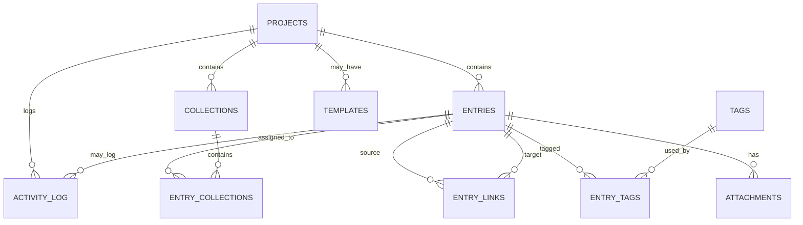

# 040 Database Design – SASD Workbench Core

**Projekt:** SASD Workbench  
**Dokument:** 040_Database_Design.md  
**Dokumenttyp:** Datenbankdesign / Database Design Document  
**Organisation:** SASD-GmbH – Scientific and Software Development  
**Status:** Entwurf 1.0  
**Datum:** 2026-05-12  
**Sprache:** Deutsch  
**Zielversionen:** V0.1 bis V4.0  
**Primäre Zielplattform V1:** Lokale Desktop-Anwendung  
**Technologievorschlag V1:** C# / .NET 8 / Windows Forms / SQLite  

---

## Inhaltsverzeichnis

1. [Zweck des Dokuments](#1-zweck-des-dokuments)
2. [Einordnung in Lastenheft, Pflichtenheft und Architektur](#2-einordnung-in-lastenheft-pflichtenheft-und-architektur)
3. [Leitprinzipien der Datenhaltung](#3-leitprinzipien-der-datenhaltung)
4. [Core-first-Datenmodell](#4-core-first-datenmodell)
5. [Versionierte Datenbankstrategie](#5-versionierte-datenbankstrategie)
6. [Speicherorte und Dateiablage](#6-speicherorte-und-dateiablage)
7. [ID-, Zeit- und Löschkonzept](#7-id--zeit--und-löschkonzept)
8. [Tabellenübersicht](#8-tabellenübersicht)
9. [Beziehungsmodell](#9-beziehungsmodell)
10. [Tabellen im Detail](#10-tabellen-im-detail)
11. [SQLite-DDL-Entwurf für V1](#11-sqlite-ddl-entwurf-für-v1)
12. [Indizes und Suchstrategie](#12-indizes-und-suchstrategie)
13. [Anhänge und Dateispeicher](#13-anhänge-und-dateispeicher)
14. [Templates, Profile und spätere Fachmodule](#14-templates-profile-und-spätere-fachmodule)
15. [Activity Log, Historie und Audit-Ausblick](#15-activity-log-historie-und-audit-ausblick)
16. [Export, Import, Backup und Restore](#16-export-import-backup-und-restore)
17. [Datenschutz, Sicherheit und sensible Daten](#17-datenschutz-sicherheit-und-sensible-daten)
18. [Migrationen und Schema-Versionierung](#18-migrationen-und-schema-versionierung)
19. [Repository- und Service-Auswirkungen](#19-repository--und-service-auswirkungen)
20. [Funktionen nach Version und Datenstruktur](#20-funktionen-nach-version-und-datenstruktur)
21. [Bewusst zurückgestellte Spezialtabellen](#21-bewusst-zurückgestellte-spezialtabellen)
22. [Offene Entscheidungen](#22-offene-entscheidungen)
23. [Abnahmekriterien für V1](#23-abnahmekriterien-für-v1)
24. [Empfohlene Entwicklungsreihenfolge](#24-empfohlene-entwicklungsreihenfolge)
25. [Zusammenfassung](#25-zusammenfassung)

---

## 1. Zweck des Dokuments

Dieses Dokument beschreibt das Datenbankdesign der **SASD Workbench Core**. Es konkretisiert die Anforderungen aus Lastenheft, Pflichtenheft und Architektur-Dokument auf Ebene der lokalen Datenhaltung.

Das Dokument beantwortet insbesondere folgende Fragen:

- Welche Datenobjekte braucht die SASD Workbench in Version 1?
- Welche Tabellen müssen sofort vorhanden sein?
- Welche Tabellen werden für spätere Versionen vorbereitet?
- Wie werden Projekte, Einträge, Collections, Templates, Anhänge, Tags, Querverweise und Aktivitäten gespeichert?
- Wie unterstützt das Datenmodell Export, Backup, Restore, spätere Historie und Profile?
- Wie bleibt das Datenmodell flexibel genug für LabBook, Linux Admin Notebook, Prompt Notebook, Biblical Research, Recipe und Food & Health?

Das Dokument ist bewusst **Core-first** aufgebaut. Es soll nicht alle zukünftigen Spezialfälle vorwegnehmen, sondern einen stabilen Kern definieren, der spätere Fachprofile nicht blockiert.

---

## 2. Einordnung in Lastenheft, Pflichtenheft und Architektur

### 2.1 Bezug zum Lastenheft

Das Lastenheft beschreibt das fachliche Ziel der Anwendung: Eine lokale, modulare Workbench für strukturierte Dokumentation, Forschung, Projektarbeit, Experimente, technische Notizen, Export und Backup.

Das Datenbankdesign übersetzt dieses Ziel in persistente Strukturen.

### 2.2 Bezug zum Pflichtenheft

Das Pflichtenheft legt fest, welche Funktionen in welcher Version entstehen sollen. Das Datenbankdesign ordnet diesen Funktionen Tabellen, Beziehungen und spätere Erweiterungspunkte zu.

| Funktion aus Pflichtenheft | Datenbankstruktur |
|---|---|
| Projektverwaltung | `projects` |
| Eintragsverwaltung | `entries` |
| Collections / Sammlungen | `collections`, `entry_collections` |
| Tags | `tags`, `entry_tags` |
| Vorlagen | `templates` |
| Anhänge | `attachments` + Dateispeicher |
| Suche und Filter | Indizes, später SQLite FTS |
| Querverweise | `entry_links` |
| Activity Log Light | `activity_log` |
| Export und Backup | konsistente Core-Tabellen + Datenordnerstruktur |
| spätere Profile | `profile_key`, später Profil-Tabellen |
| spätere Historie | `entry_versions` |

### 2.3 Bezug zum Architektur-Dokument

Das Architektur-Dokument sieht folgende Abhängigkeiten vor:

```text
UI → Application Services → Repositories → SQLite / File Storage
```

Die Datenbank gehört zur Infrastructure-Schicht. Sie darf nicht direkt aus Windows-Forms-Eventhandlern angesprochen werden. Datenbankzugriffe erfolgen über Repositories und Application Services.

---

## 3. Leitprinzipien der Datenhaltung

### 3.1 Core-first statt Spezialtabellen-first

Die SASD Workbench soll zuerst eine gemeinsame Kern-App werden. Deshalb werden in V1 keine eigenen Tabellen für jedes mögliche spätere Produkt erstellt.

Nicht in V1:

```text
recipes
blood_values
bible_verses
linux_hosts
prompt_runs
lab_samples
measurements
devices
inventory_items
```

Stattdessen gibt es einen flexiblen Kern:

```text
projects
collections
entries
templates
attachments
tags
entry_links
activity_log
```

### 3.2 Entry als zentrales Objekt

Der zentrale Inhaltstyp ist `Entry`. Ein Entry kann fachlich sehr unterschiedlich verwendet werden:

- allgemeine Notiz,
- Experiment,
- Forschungsnotiz,
- Meeting-Notiz,
- Sticky,
- Fehleranalyse,
- Testlauf,
- Architekturentscheidung,
- Deployment-Protokoll,
- Linux-Wartungsnotiz,
- Bibel-/Themen-Recherche,
- Quellenanalyse,
- Rezeptversuch,
- Prompt-Test,
- Gesundheitsnotiz.

Damit bleibt das Datenmodell kompakt und erweiterbar.

### 3.3 V1 einfach, aber nicht kurzsichtig

V1 nutzt zunächst Markdown/Text als Inhalt. Trotzdem werden die Daten so gespeichert, dass spätere Ausbaustufen möglich bleiben:

- `version` für einfache Versionierung,
- `created_at` und `updated_at`,
- `created_by` und `updated_by`,
- Soft Delete,
- Activity Log,
- Tags,
- Collections,
- Querverweise,
- `profile_key` für spätere Profile.

### 3.4 Lokale Datenhoheit

V1 speichert lokal und offline. Es gibt keine automatische Cloud, keinen Zwangsserver und keine automatische KI-Übertragung.

### 3.5 Exportierbarkeit

Das Datenmodell muss Export unterstützen:

- Markdown,
- HTML,
- später PDF,
- Projekt-ZIP,
- Backup-ZIP,
- später Obsidian-/DokuWiki-nahe Ordnerstrukturen.

### 3.6 Backup-Fähigkeit

Datenbank und Dateispeicher müssen gemeinsam gesichert werden können. Anhänge dürfen nicht unkontrolliert über das Dateisystem verteilt sein.

---

## 4. Core-first-Datenmodell

Die SASD Workbench wird um folgende Kernobjekte herum modelliert:

```text
Project
  Collection
  Entry
    Attachment
    Tag
    EntryLink
    ActivityLogItem
  Template
```

### 4.1 Fachlichkeit über Typen, Templates und Tags

V1 bildet Fachlichkeit nicht über viele Spezialtabellen ab, sondern über:

- `entry_type`,
- `status`,
- `profile_key`,
- Templates,
- Tags,
- Markdown-Inhalte,
- Anhänge,
- Querverweise.

Beispiel:

```text
Ein Rezeptversuch:
  entries.entry_type = recipe_experiment
  templates.name = Rezeptversuch

Ein Prompt-Test:
  entries.entry_type = prompt_test
  templates.name = Prompt-Test

Eine Bibelrecherche:
  entries.entry_type = biblical_topic
  templates.name = Bibel-/Themen-Recherche
```

### 4.2 Spätere Spezialmodule

Wenn ein Profil später reif genug ist, können Zusatzdaten ergänzt werden. Der Entry bleibt dabei der zentrale Bezugspunkt.

Beispiel:

```text
prompt_runs.entry_id → entries.id
recipe_details.entry_id → entries.id
linux_host_notes.entry_id → entries.id
lab_measurements.entry_id → entries.id
```

So bleibt der Kern stabil, während Fachmodule wachsen können.

---

## 5. Versionierte Datenbankstrategie

### 5.1 V0.1 – Technischer Prototyp

Minimal benötigt:

- `schema_migrations`,
- `app_settings`,
- `projects`,
- `entries`.

Ziel:

- Datenbank anlegen,
- Projekt speichern,
- einfachen Eintrag speichern,
- Daten nach Neustart wieder laden.

### 5.2 V0.5 – Interner MVP

Zusätzlich:

- `templates`,
- `tags`,
- `entry_tags`,
- `attachments`.

Ziel:

- Eintragstypen,
- Status,
- Tags,
- erste Vorlagen,
- erste Anhänge,
- einfache Suche.

### 5.3 V1.0 – Lokaler Desktop-MVP

Zusätzlich oder voll aktiviert:

- `collections`,
- `entry_collections`,
- `entry_links`,
- `activity_log`,
- stabilisierte Anhangsverwaltung,
- Export-/Backup-relevante Metadaten.

Ziel:

- Collections,
- Suche und Filter,
- Markdown-Export,
- HTML-Export optional,
- Backup/Restore,
- Activity Log Light.

### 5.4 V1.1 – Komfort und Datenqualität

Mögliche Ergänzungen:

- `entry_external_links`,
- `attachment_templates`,
- bessere Template-Metadaten,
- bessere Fehler- und Aktivitätsprotokollierung.

### 5.5 V2.0 – Journal, PDF, Historie, Ressourcen

Mögliche Ergänzungen:

- `entry_versions`,
- `resources`,
- `timers`,
- `export_jobs`,
- `saved_searches`,
- FTS-Tabellen für Volltextsuche.

Ziel:

- PDF-Export,
- Journal,
- Versionshistorie,
- Timer,
- Ressourcen-Bibliothek,
- CSV-Import,
- Markdown-Import,
- Projekt-ZIP-Export.

### 5.6 V3.0 – Fachprofile

Mögliche Ergänzungen:

- `profiles`,
- `profile_entry_types`,
- `profile_statuses`,
- `profile_templates`,
- profilabhängige Standardwerte.

Ziel:

- LabBook,
- Software/Engineering,
- Linux Admin,
- Prompt Notebook,
- Biblical Research,
- Recipe,
- Food & Health.

### 5.7 V4.0 – Team, Sicherheit, Sync, KI

Mögliche Ergänzungen:

- `users`,
- `roles`,
- `project_members`,
- `review_requests`,
- `signatures`,
- `audit_chain`,
- `sync_state`,
- `encryption_metadata`,
- `ai_actions`.

Ziel:

- Benutzer/Rollen,
- Review,
- Signatur/Freigabe,
- manipulationsärmerer Audit Trail,
- Verschlüsselung,
- Sync,
- CLI/API,
- optionale KI-Unterstützung.

---

## 6. Speicherorte und Dateiablage

### 6.1 Empfohlene Datenordnerstruktur

```text
SASDWorkbenchData/
  workbench.db
  attachments/
    project-{projectId}/
      entry-{entryId}/
        {attachmentId}_{safeOriginalFileName}
  backups/
  exports/
  templates/
  logs/
  resources/
```

### 6.2 Warum SQLite plus Dateisystem?

SQLite speichert strukturierte Daten. Große Anhänge werden im Dateisystem abgelegt.

Vorteile:

- Datenbank bleibt kleiner,
- Anhänge können direkt geöffnet werden,
- Backups bleiben verständlich,
- Export nach Markdown/HTML wird einfacher,
- spätere Synchronisation ist nachvollziehbarer.

### 6.3 Anhangsstrategie

Wenn der Anwender eine Datei anhängt, wird sie in den Workbench-Datenordner kopiert.

Die Anwendung speichert in der Datenbank:

- ursprünglicher Dateiname,
- gespeicherter Dateiname,
- relativer Pfad,
- Dateigröße,
- Dateityp,
- optional SHA-256-Hash,
- Kommentar,
- Löschstatus.

---

## 7. ID-, Zeit- und Löschkonzept

### 7.1 IDs

IDs werden als `TEXT` gespeichert und in der Anwendung als UUID/GUID erzeugt.

Beispiel:

```text
8f4f5396-4f55-4df8-9ad3-16c9db59b8c2
```

Vorteile:

- offline erzeugbar,
- import-/exportfreundlich,
- spätere Synchronisation leichter,
- lesbarer als BLOB.

### 7.2 Zeitstempel

Alle technischen Zeitstempel werden in UTC gespeichert.

Empfohlenes Format:

```text
2026-05-12T14:23:51.000Z
```

### 7.3 Autorenfelder

Für V1 reicht ein lokaler Standardautor. Trotzdem werden Felder vorbereitet:

- `created_by`,
- `updated_by`,
- später `deleted_by`,
- später Benutzer-IDs.

### 7.4 Soft Delete

Zentrale Tabellen erhalten Soft-Delete-Felder:

- `is_deleted`,
- `deleted_at`.

Vorteile:

- Schutz vor versehentlichem Datenverlust,
- spätere Restore-/Audit-Funktionen leichter,
- Activity Log bleibt konsistenter.

### 7.5 Archivierung

Archivierung und Löschung sind getrennt:

- `is_archived = 1`: nicht aktiv, aber noch bewusst vorhanden.
- `is_deleted = 1`: gelöscht/ausgeblendet, aber zunächst nicht hart entfernt.

---

## 8. Tabellenübersicht

### 8.1 Muss-Tabellen für V1

| Tabelle | Zweck | Ab Version |
|---|---|---:|
| `schema_migrations` | Datenbankschema-Versionierung | 0.1 |
| `app_settings` | lokale Anwendungseinstellungen | 0.1 |
| `projects` | Projekte / Arbeitsräume | 0.1 |
| `entries` | zentrale Inhalte | 0.1 |
| `templates` | Vorlagen für neue Einträge | 0.5 |
| `tags` | Tag-Stammdaten | 0.5 |
| `entry_tags` | Zuordnung Entry ↔ Tag | 0.5 |
| `attachments` | Dateianhänge zu Einträgen | 0.5 |
| `collections` | Sammlungen innerhalb von Projekten | 1.0 |
| `entry_collections` | Zuordnung Entry ↔ Collection | 1.0 |
| `entry_links` | Querverweise zwischen Einträgen | 1.0 |
| `activity_log` | einfache Aktivitätshistorie | 1.0 |

### 8.2 Optionale Tabellen für V1.1/V2

| Tabelle | Zweck | Früheste Version |
|---|---|---:|
| `entry_external_links` | strukturierte externe Links | 1.1 |
| `attachment_templates` | Dateivorlagen für Anhänge | 1.1 |
| `entry_versions` | Versionshistorie | 2.0 |
| `timers` | Timer, Stopwatch, Countdown | 2.0 |
| `resources` | Ressourcen-Bibliothek | 2.0 |
| `export_jobs` | Exportprotokolle | 2.0 |
| `saved_searches` | gespeicherte Filter/Suchen | 2.0 |
| `entry_fts` | Volltextsuche über SQLite FTS | 2.0 |

---

## 9. Beziehungsmodell



### 9.1 Kardinalitäten

| Beziehung | Typ | Bemerkung |
|---|---|---|
| Project → Entries | 1:n | Ein Entry gehört zu einem Projekt |
| Project → Collections | 1:n | Collections liegen innerhalb eines Projekts |
| Collection → Collection | 1:n | Verschachtelung über `parent_collection_id` |
| Entry ↔ Collection | n:m | über `entry_collections` |
| Entry ↔ Tag | n:m | über `entry_tags` |
| Entry → Attachment | 1:n | Ein Entry kann viele Anhänge haben |
| Entry ↔ Entry | n:m | über `entry_links` |
| Project → Template | 1:n optional | systemweite und projektspezifische Vorlagen möglich |
| Entry → Activity Log | 1:n optional | Aktivitäten können entrybezogen sein |

---

## 10. Tabellen im Detail

### 10.1 `schema_migrations`

Speichert ausgeführte Datenbankmigrationen.

| Feld | Typ | Pflicht | Beschreibung |
|---|---|---:|---|
| `id` | TEXT | ja | eindeutige Migrations-ID |
| `name` | TEXT | ja | sprechender Name |
| `applied_at` | TEXT | ja | UTC-Zeitpunkt |

Beispiele:

```text
001_initial_schema
002_templates_tags_attachments
003_collections_links_activity
```

### 10.2 `app_settings`

Speichert lokale Einstellungen.

| Feld | Typ | Pflicht | Beschreibung |
|---|---|---:|---|
| `key` | TEXT | ja | Einstellungsschlüssel |
| `value` | TEXT | nein | Wert als Text oder JSON |
| `updated_at` | TEXT | ja | UTC |

Beispiele:

- letzter Projektpfad,
- Standardautor,
- letzter Exportordner,
- UI-Einstellungen.

### 10.3 `projects`

Speichert Arbeitsräume.

| Feld | Typ | Pflicht | Beschreibung |
|---|---|---:|---|
| `id` | TEXT | ja | UUID |
| `name` | TEXT | ja | Projektname |
| `description` | TEXT | nein | Beschreibung |
| `profile_key` | TEXT | nein | z. B. `general`, `labbook` |
| `status` | TEXT | ja | z. B. `active`, `archived` |
| `created_at` | TEXT | ja | UTC |
| `updated_at` | TEXT | ja | UTC |
| `created_by` | TEXT | nein | lokaler Autor |
| `updated_by` | TEXT | nein | lokaler Autor |
| `is_archived` | INTEGER | ja | 0/1 |
| `is_deleted` | INTEGER | ja | 0/1 |
| `deleted_at` | TEXT | nein | UTC |
| `sort_order` | INTEGER | nein | spätere manuelle Sortierung |

### 10.4 `collections`

Speichert flexible Sammlungen innerhalb eines Projekts.

| Feld | Typ | Pflicht | Beschreibung |
|---|---|---:|---|
| `id` | TEXT | ja | UUID |
| `project_id` | TEXT | ja | Projekt |
| `parent_collection_id` | TEXT | nein | verschachtelte Collections |
| `name` | TEXT | ja | Name |
| `description` | TEXT | nein | Beschreibung |
| `created_at` | TEXT | ja | UTC |
| `updated_at` | TEXT | ja | UTC |
| `sort_order` | INTEGER | nein | Reihenfolge |
| `is_deleted` | INTEGER | ja | 0/1 |
| `deleted_at` | TEXT | nein | UTC |

Designentscheidung: Ein Entry erhält keine direkte `collection_id`. Die Zuordnung erfolgt über `entry_collections`.

### 10.5 `entries`

Speichert die zentralen Inhalte.

| Feld | Typ | Pflicht | Beschreibung |
|---|---|---:|---|
| `id` | TEXT | ja | UUID |
| `project_id` | TEXT | ja | Projekt |
| `entry_type` | TEXT | ja | fachlicher Typ |
| `status` | TEXT | ja | Status |
| `title` | TEXT | ja | Titel |
| `summary` | TEXT | nein | Kurzbeschreibung |
| `content_markdown` | TEXT | nein | Hauptinhalt |
| `created_at` | TEXT | ja | UTC |
| `updated_at` | TEXT | ja | UTC |
| `created_by` | TEXT | nein | lokaler Autor |
| `updated_by` | TEXT | nein | lokaler Autor |
| `version` | INTEGER | ja | einfache Versionsnummer |
| `is_archived` | INTEGER | ja | 0/1 |
| `is_deleted` | INTEGER | ja | 0/1 |
| `deleted_at` | TEXT | nein | UTC |
| `sort_order` | INTEGER | nein | optionale Reihenfolge |

Beispiele für `entry_type`:

```text
note
experiment
research_note
meeting_note
sticky
bug_analysis
test_run
architecture_decision
deployment_protocol
linux_admin_note
prompt_test
biblical_topic
recipe_experiment
health_note
```

Beispiele für `status`:

```text
draft
planned
in_work
in_review
completed
deferred
aborted
archived
signed
released
```

### 10.6 `entry_collections`

Verknüpft Einträge mit Collections.

| Feld | Typ | Pflicht | Beschreibung |
|---|---|---:|---|
| `entry_id` | TEXT | ja | Entry |
| `collection_id` | TEXT | ja | Collection |
| `created_at` | TEXT | ja | UTC |

Primärschlüssel:

```text
(entry_id, collection_id)
```

### 10.7 `tags`

Speichert frei verwendbare Schlagworte.

| Feld | Typ | Pflicht | Beschreibung |
|---|---|---:|---|
| `id` | TEXT | ja | UUID |
| `name` | TEXT | ja | Tagname |
| `normalized_name` | TEXT | ja | normalisierte Form |
| `color` | TEXT | nein | spätere UI-Farbe |
| `created_at` | TEXT | ja | UTC |
| `updated_at` | TEXT | ja | UTC |
| `is_deleted` | INTEGER | ja | 0/1 |

### 10.8 `entry_tags`

Verknüpft Einträge mit Tags.

| Feld | Typ | Pflicht | Beschreibung |
|---|---|---:|---|
| `entry_id` | TEXT | ja | Entry |
| `tag_id` | TEXT | ja | Tag |
| `created_at` | TEXT | ja | UTC |

Primärschlüssel:

```text
(entry_id, tag_id)
```

### 10.9 `templates`

Speichert Vorlagen für neue Einträge.

| Feld | Typ | Pflicht | Beschreibung |
|---|---|---:|---|
| `id` | TEXT | ja | UUID |
| `project_id` | TEXT | nein | optional projektspezifisch |
| `profile_key` | TEXT | nein | Profil |
| `name` | TEXT | ja | Vorlagenname |
| `description` | TEXT | nein | Beschreibung |
| `entry_type` | TEXT | ja | Entry Type |
| `default_status` | TEXT | ja | Standardstatus |
| `content_markdown` | TEXT | ja | Vorlageninhalt |
| `is_system_template` | INTEGER | ja | 0/1 |
| `is_deleted` | INTEGER | ja | 0/1 |
| `created_at` | TEXT | ja | UTC |
| `updated_at` | TEXT | ja | UTC |
| `sort_order` | INTEGER | nein | Reihenfolge |

Wichtig: Beim Anwenden wird der Template-Inhalt in den neuen Entry kopiert. Das Original-Template bleibt unverändert.

### 10.10 `attachments`

Speichert Metadaten zu angehängten Dateien.

| Feld | Typ | Pflicht | Beschreibung |
|---|---|---:|---|
| `id` | TEXT | ja | UUID |
| `entry_id` | TEXT | ja | zugehöriger Entry |
| `original_file_name` | TEXT | ja | ursprünglicher Dateiname |
| `stored_file_name` | TEXT | ja | sicherer gespeicherter Dateiname |
| `relative_path` | TEXT | ja | Pfad relativ zum Datenordner |
| `mime_type` | TEXT | nein | MIME-Type |
| `file_extension` | TEXT | nein | Dateiendung |
| `file_size` | INTEGER | nein | Größe in Bytes |
| `sha256_hash` | TEXT | nein | Prüfsumme |
| `comment` | TEXT | nein | Kommentar |
| `created_at` | TEXT | ja | UTC |
| `updated_at` | TEXT | ja | UTC |
| `is_deleted` | INTEGER | ja | 0/1 |
| `deleted_at` | TEXT | nein | UTC |

### 10.11 `entry_links`

Speichert interne Querverweise zwischen Einträgen.

| Feld | Typ | Pflicht | Beschreibung |
|---|---|---:|---|
| `id` | TEXT | ja | UUID |
| `source_entry_id` | TEXT | ja | Ausgangseintrag |
| `target_entry_id` | TEXT | ja | Zieleintrag |
| `relation_type` | TEXT | ja | Art der Beziehung |
| `comment` | TEXT | nein | Kommentar |
| `created_at` | TEXT | ja | UTC |
| `created_by` | TEXT | nein | lokaler Autor |
| `is_deleted` | INTEGER | ja | 0/1 |

Relationstypen:

```text
related_to
based_on
confirms
contradicts
replaces
uses
variant_of
repeats
belongs_to
compares_with
```

### 10.12 `activity_log`

Speichert wichtige Aktionen.

| Feld | Typ | Pflicht | Beschreibung |
|---|---|---:|---|
| `id` | TEXT | ja | UUID |
| `project_id` | TEXT | nein | Projekt |
| `entry_id` | TEXT | nein | Entry |
| `action_type` | TEXT | ja | Aktion |
| `description` | TEXT | nein | lesbare Beschreibung |
| `old_value` | TEXT | nein | alter Wert, optional JSON |
| `new_value` | TEXT | nein | neuer Wert, optional JSON |
| `created_at` | TEXT | ja | UTC |
| `created_by` | TEXT | nein | lokaler Autor |

V1-Activity-Log ist nicht manipulationssicher. Es dient der Nachvollziehbarkeit, nicht der regulatorischen Beweissicherung.

---

## 11. SQLite-DDL-Entwurf für V1

> Hinweis: Das folgende DDL ist ein erster, implementierungsnaher Entwurf für die V1-Struktur.

```sql
PRAGMA foreign_keys = ON;

CREATE TABLE IF NOT EXISTS schema_migrations (
    id TEXT PRIMARY KEY,
    name TEXT NOT NULL,
    applied_at TEXT NOT NULL
);

CREATE TABLE IF NOT EXISTS app_settings (
    key TEXT PRIMARY KEY,
    value TEXT NULL,
    updated_at TEXT NOT NULL
);

CREATE TABLE IF NOT EXISTS projects (
    id TEXT PRIMARY KEY,
    name TEXT NOT NULL,
    description TEXT NULL,
    profile_key TEXT NULL,
    status TEXT NOT NULL DEFAULT 'active',
    created_at TEXT NOT NULL,
    updated_at TEXT NOT NULL,
    created_by TEXT NULL,
    updated_by TEXT NULL,
    is_archived INTEGER NOT NULL DEFAULT 0,
    is_deleted INTEGER NOT NULL DEFAULT 0,
    deleted_at TEXT NULL,
    sort_order INTEGER NULL
);

CREATE TABLE IF NOT EXISTS collections (
    id TEXT PRIMARY KEY,
    project_id TEXT NOT NULL,
    parent_collection_id TEXT NULL,
    name TEXT NOT NULL,
    description TEXT NULL,
    created_at TEXT NOT NULL,
    updated_at TEXT NOT NULL,
    sort_order INTEGER NULL,
    is_deleted INTEGER NOT NULL DEFAULT 0,
    deleted_at TEXT NULL,
    FOREIGN KEY (project_id) REFERENCES projects(id) ON DELETE CASCADE,
    FOREIGN KEY (parent_collection_id) REFERENCES collections(id) ON DELETE SET NULL
);

CREATE TABLE IF NOT EXISTS entries (
    id TEXT PRIMARY KEY,
    project_id TEXT NOT NULL,
    entry_type TEXT NOT NULL,
    status TEXT NOT NULL DEFAULT 'draft',
    title TEXT NOT NULL,
    summary TEXT NULL,
    content_markdown TEXT NULL,
    created_at TEXT NOT NULL,
    updated_at TEXT NOT NULL,
    created_by TEXT NULL,
    updated_by TEXT NULL,
    version INTEGER NOT NULL DEFAULT 1,
    is_archived INTEGER NOT NULL DEFAULT 0,
    is_deleted INTEGER NOT NULL DEFAULT 0,
    deleted_at TEXT NULL,
    sort_order INTEGER NULL,
    FOREIGN KEY (project_id) REFERENCES projects(id) ON DELETE CASCADE
);

CREATE TABLE IF NOT EXISTS entry_collections (
    entry_id TEXT NOT NULL,
    collection_id TEXT NOT NULL,
    created_at TEXT NOT NULL,
    PRIMARY KEY (entry_id, collection_id),
    FOREIGN KEY (entry_id) REFERENCES entries(id) ON DELETE CASCADE,
    FOREIGN KEY (collection_id) REFERENCES collections(id) ON DELETE CASCADE
);

CREATE TABLE IF NOT EXISTS tags (
    id TEXT PRIMARY KEY,
    name TEXT NOT NULL,
    normalized_name TEXT NOT NULL UNIQUE,
    color TEXT NULL,
    created_at TEXT NOT NULL,
    updated_at TEXT NOT NULL,
    is_deleted INTEGER NOT NULL DEFAULT 0
);

CREATE TABLE IF NOT EXISTS entry_tags (
    entry_id TEXT NOT NULL,
    tag_id TEXT NOT NULL,
    created_at TEXT NOT NULL,
    PRIMARY KEY (entry_id, tag_id),
    FOREIGN KEY (entry_id) REFERENCES entries(id) ON DELETE CASCADE,
    FOREIGN KEY (tag_id) REFERENCES tags(id) ON DELETE CASCADE
);

CREATE TABLE IF NOT EXISTS templates (
    id TEXT PRIMARY KEY,
    project_id TEXT NULL,
    profile_key TEXT NULL,
    name TEXT NOT NULL,
    description TEXT NULL,
    entry_type TEXT NOT NULL,
    default_status TEXT NOT NULL DEFAULT 'draft',
    content_markdown TEXT NOT NULL,
    is_system_template INTEGER NOT NULL DEFAULT 0,
    is_deleted INTEGER NOT NULL DEFAULT 0,
    created_at TEXT NOT NULL,
    updated_at TEXT NOT NULL,
    sort_order INTEGER NULL,
    FOREIGN KEY (project_id) REFERENCES projects(id) ON DELETE CASCADE
);

CREATE TABLE IF NOT EXISTS attachments (
    id TEXT PRIMARY KEY,
    entry_id TEXT NOT NULL,
    original_file_name TEXT NOT NULL,
    stored_file_name TEXT NOT NULL,
    relative_path TEXT NOT NULL,
    mime_type TEXT NULL,
    file_extension TEXT NULL,
    file_size INTEGER NULL,
    sha256_hash TEXT NULL,
    comment TEXT NULL,
    created_at TEXT NOT NULL,
    updated_at TEXT NOT NULL,
    is_deleted INTEGER NOT NULL DEFAULT 0,
    deleted_at TEXT NULL,
    FOREIGN KEY (entry_id) REFERENCES entries(id) ON DELETE CASCADE
);

CREATE TABLE IF NOT EXISTS entry_links (
    id TEXT PRIMARY KEY,
    source_entry_id TEXT NOT NULL,
    target_entry_id TEXT NOT NULL,
    relation_type TEXT NOT NULL DEFAULT 'related_to',
    comment TEXT NULL,
    created_at TEXT NOT NULL,
    created_by TEXT NULL,
    is_deleted INTEGER NOT NULL DEFAULT 0,
    FOREIGN KEY (source_entry_id) REFERENCES entries(id) ON DELETE CASCADE,
    FOREIGN KEY (target_entry_id) REFERENCES entries(id) ON DELETE CASCADE
);

CREATE TABLE IF NOT EXISTS activity_log (
    id TEXT PRIMARY KEY,
    project_id TEXT NULL,
    entry_id TEXT NULL,
    action_type TEXT NOT NULL,
    description TEXT NULL,
    old_value TEXT NULL,
    new_value TEXT NULL,
    created_at TEXT NOT NULL,
    created_by TEXT NULL,
    FOREIGN KEY (project_id) REFERENCES projects(id) ON DELETE SET NULL,
    FOREIGN KEY (entry_id) REFERENCES entries(id) ON DELETE SET NULL
);
```

---

## 12. Indizes und Suchstrategie

### 12.1 V1-Indizes

```sql
CREATE INDEX IF NOT EXISTS idx_projects_is_deleted
    ON projects(is_deleted);

CREATE INDEX IF NOT EXISTS idx_entries_project_id
    ON entries(project_id);

CREATE INDEX IF NOT EXISTS idx_entries_project_status
    ON entries(project_id, status);

CREATE INDEX IF NOT EXISTS idx_entries_project_type
    ON entries(project_id, entry_type);

CREATE INDEX IF NOT EXISTS idx_entries_updated_at
    ON entries(updated_at);

CREATE INDEX IF NOT EXISTS idx_entries_is_deleted
    ON entries(is_deleted);

CREATE INDEX IF NOT EXISTS idx_collections_project_id
    ON collections(project_id);

CREATE INDEX IF NOT EXISTS idx_attachments_entry_id
    ON attachments(entry_id);

CREATE INDEX IF NOT EXISTS idx_entry_links_source
    ON entry_links(source_entry_id);

CREATE INDEX IF NOT EXISTS idx_entry_links_target
    ON entry_links(target_entry_id);

CREATE INDEX IF NOT EXISTS idx_activity_project
    ON activity_log(project_id, created_at);

CREATE INDEX IF NOT EXISTS idx_activity_entry
    ON activity_log(entry_id, created_at);
```

### 12.2 V1-Suche

V1 kann einfache `LIKE`-Suchen verwenden:

```sql
SELECT *
FROM entries
WHERE project_id = @projectId
  AND is_deleted = 0
  AND (
      title LIKE @query
      OR summary LIKE @query
      OR content_markdown LIKE @query
  )
ORDER BY updated_at DESC;
```

### 12.3 V2-Suche mit SQLite FTS

Für V2 wird SQLite FTS5 empfohlen:

```sql
CREATE VIRTUAL TABLE entry_fts USING fts5(
    entry_id UNINDEXED,
    title,
    summary,
    content_markdown
);
```

Offene Entscheidung:

- Aktualisierung per Trigger,
- oder Aktualisierung über Application Service.

---

## 13. Anhänge und Dateispeicher

### 13.1 Grundprinzip

Anhänge bestehen aus:

1. Metadaten in `attachments`.
2. Datei im lokalen Workbench-Datenordner.

### 13.2 Gespeicherter Dateiname

Empfehlung:

```text
{attachmentId}_{sanitizedOriginalFileName}
```

Beispiel:

```text
44cdaf22-9e8a-4c35-98d3-d1c4a0a9105a_database-blueprint.md
```

### 13.3 Attachment-Aktionen V1

V1 sollte unterstützen:

- Datei hinzufügen,
- Datei öffnen,
- Datei im Dateimanager anzeigen,
- Kommentar ändern,
- Anhang entfernen.

### 13.4 Spätere Attachment-Aktionen

Später sinnvoll:

- Vorschau,
- Ersetzen,
- Versionieren,
- Prüfsumme kontrollieren,
- Kopieren in Zwischenablage,
- Attachment Templates.

---

## 14. Templates, Profile und spätere Fachmodule

### 14.1 Templates als erste Fachlichkeit

Templates ersetzen in V1 viele Spezialmasken.

Mindesttemplates für V1:

- Allgemeine Notiz,
- Experiment,
- Fehleranalyse,
- Meeting-Protokoll,
- ADR / Architekturentscheidung,
- Prompt-Test,
- Linux-Wartungsprotokoll,
- Rezeptversuch,
- Bibel-/Themen-Recherche.

### 14.2 `profile_key`

Mögliche Werte:

```text
general
labbook
software_engineering
linux_admin
prompt_notebook
biblical_research
recipe
food_health
```

In V1 ist `profile_key` ein Textfeld. In V3 kann daraus echte Profilverwaltung werden.

### 14.3 Spätere Profil-Tabellen

V3 kann ergänzen:

```text
profiles
profile_entry_types
profile_statuses
profile_templates
profile_default_tags
```

---

## 15. Activity Log, Historie und Audit-Ausblick

### 15.1 V1 Activity Log Light

V1 speichert wichtige Aktionen:

- Projekt erstellt,
- Eintrag erstellt,
- Eintrag geändert,
- Status geändert,
- Anhang hinzugefügt,
- Anhang entfernt,
- Export erstellt,
- Backup erstellt,
- Restore durchgeführt.

### 15.2 Keine regulatorische Revisionssicherheit in V1

V1 garantiert nicht:

- Unveränderbarkeit,
- rechtssichere elektronische Signatur,
- GxP-/GLP-/FDA-Compliance,
- forensische Manipulationssicherheit.

### 15.3 V2 Versionshistorie

V2 kann `entry_versions` ergänzen.

Mögliche Strategien:

| Strategie | Vorteil | Nachteil |
|---|---|---|
| Version bei jedem Speichern | vollständig | viel Datenmenge |
| expliziter Snapshot | kontrolliert | Nutzer muss daran denken |
| Snapshot bei Statuswechsel | sinnvoller Kompromiss | nicht jede Änderung gesichert |
| Auto-Snapshot nach Zeitintervall | praktisch | komplexer |

Empfehlung:

- Snapshot bei Statuswechsel,
- Snapshot bei expliziter Aktion „Version sichern“,
- optional Auto-Snapshot bei größeren Änderungen.

### 15.4 V4 Audit Trail

V4 kann erweitern:

- Append-only-Log,
- Hash-Kette,
- Signaturen,
- gesperrte signierte Einträge,
- Exportprüfsummen,
- Benutzer/Rollen.

---

## 16. Export, Import, Backup und Restore

### 16.1 Markdown-Export V1

Benötigt:

- `projects`,
- `entries`,
- `tags`,
- `collections`,
- `attachments`.

Beispielstruktur:

```text
project-export/
  README.md
  entries/
    2026-05-12_mvp-functional-specification.md
  attachments/
    ...
  metadata.json
```

### 16.2 Backup V1

Backup umfasst:

```text
sasd-workbench-backup-2026-05-12T1423.zip
  manifest.json
  workbench.db
  attachments/
  templates/
```

### 16.3 Restore V1

Restore muss prüfen:

- Manifest vorhanden,
- Datenbank vorhanden,
- Anhänge vorhanden,
- Schema-Version passend,
- Zielordner beschreibbar,
- bestehende Daten geschützt.

### 16.4 Projekt-ZIP-Export V2

Ein Projekt-ZIP ist kein vollständiges Backup, sondern ein Austausch-/Archivformat für ein Projekt.

### 16.5 Import V2

Offene Fragen:

- IDs beibehalten oder neu erzeugen?
- Konflikte erkennen?
- Tags zusammenführen?
- Collections übernehmen?
- Anhänge kopieren?

---

## 17. Datenschutz, Sicherheit und sensible Daten

### 17.1 Lokale Speicherung

V1 speichert lokal. Externe Dienste werden nicht automatisch kontaktiert.

### 17.2 Kein Schutz gegen lokalen Angreifer

V1 schützt nicht automatisch gegen Personen mit Zugriff auf den Rechner oder das Benutzerkonto.

### 17.3 Sensible Profile

Besonders sensibel:

- Food & Health,
- Kundendaten,
- Forschungsdaten,
- private Themenrecherche,
- interne Firmeninformationen.

### 17.4 Medizinische Abgrenzung

Food-&-Health-Funktionen dokumentieren Daten. Sie stellen keine Diagnose und geben keine Therapieempfehlung.

### 17.5 Verschlüsselung später

V4 kann ergänzen:

- verschlüsselte Backups,
- projektbezogene Verschlüsselung,
- Recovery-Konzept.

Vorher zu klären:

- Was passiert bei vergessenem Passwort?
- Werden Datenbank, Anhänge oder beides verschlüsselt?
- Wie funktioniert Suche bei Verschlüsselung?
- Wie funktioniert Restore?

---

## 18. Migrationen und Schema-Versionierung

### 18.1 Migrationstabelle

`schema_migrations` speichert ausgeführte Migrationen.

### 18.2 Migrationsdateien

Empfohlene Struktur:

```text
src/SASD.Workbench.Infrastructure/Database/Migrations/
  001_initial_schema.sql
  002_templates_tags_attachments.sql
  003_collections_links_activity.sql
  004_external_links_attachment_templates.sql
  005_versions_resources_timers.sql
```

### 18.3 Migrationsregeln

- Migrationen werden nur einmal ausgeführt.
- Jede Migration hat eine eindeutige ID.
- Vor kritischen Migrationen wird ein Backup empfohlen.
- Schema-Änderungen werden dokumentiert.
- Migrationen dürfen bestehende Daten nicht unnötig zerstören.

### 18.4 Migrationsplan

| Migration | Zielversion | Inhalt |
|---|---:|---|
| `001_initial_schema` | 0.1 | projects, entries, settings, migrations |
| `002_templates_tags_attachments` | 0.5 | templates, tags, entry_tags, attachments |
| `003_collections_links_activity` | 1.0 | collections, entry_collections, entry_links, activity_log |
| `004_external_links_attachment_templates` | 1.1 | optional |
| `005_versions_resources_timers` | 2.0 | entry_versions, resources, timers |
| `006_profiles` | 3.0 | Profil-Tabellen |
| `007_security_team_sync` | 4.0 | users, roles, audit/sync metadata |

---

## 19. Repository- und Service-Auswirkungen

### 19.1 Repositories V1

Empfohlene Repositories:

```csharp
public interface IProjectRepository
{
    Task<Project?> GetByIdAsync(Guid id);
    Task<IReadOnlyList<Project>> ListAsync(bool includeArchived = false);
    Task AddAsync(Project project);
    Task UpdateAsync(Project project);
}

public interface IEntryRepository
{
    Task<Entry?> GetByIdAsync(Guid id);
    Task<IReadOnlyList<Entry>> SearchAsync(EntrySearchCriteria criteria);
    Task AddAsync(Entry entry);
    Task UpdateAsync(Entry entry);
    Task SoftDeleteAsync(Guid id);
}

public interface ITemplateRepository
{
    Task<IReadOnlyList<EntryTemplate>> ListAsync(string? profileKey = null);
    Task<EntryTemplate?> GetByIdAsync(Guid id);
}

public interface IAttachmentRepository
{
    Task<IReadOnlyList<Attachment>> ListForEntryAsync(Guid entryId);
    Task AddAsync(Attachment attachment);
    Task SoftDeleteAsync(Guid attachmentId);
}
```

### 19.2 Application Services V1

| Service | Aufgabe |
|---|---|
| `ProjectService` | Projekte anlegen, bearbeiten, archivieren |
| `EntryService` | Einträge anlegen, speichern, suchen |
| `TemplateService` | Vorlagen laden und anwenden |
| `AttachmentService` | Dateien kopieren und Metadaten speichern |
| `TagService` | Tags verwalten |
| `ExportService` | Markdown/HTML exportieren |
| `BackupService` | Backup/Restore |
| `ActivityLogService` | Aktionen protokollieren |

### 19.3 Transaktionen

Wichtige Aktionen sollten transaktional sein:

- Entry speichern,
- Template anwenden,
- Anhang hinzufügen,
- Projekt löschen/archivieren,
- Backup/Restore,
- Migrationen.

Beispiel „Anhang hinzufügen“:

1. Datei validieren.
2. Datei in temporären Bereich kopieren.
3. DB-Datensatz anlegen.
4. Datei endgültig verschieben.
5. Activity Log schreiben.
6. Bei Fehler aufräumen.

---

## 20. Funktionen nach Version und Datenstruktur

### 20.1 V0.1

| Funktion | Tabellen | Beschreibung |
|---|---|---|
| Datenbank erstellen | `schema_migrations` | initiale DB-Anlage |
| Einstellungen speichern | `app_settings` | Datenordner, letzte Nutzung |
| Projekt anlegen | `projects` | erster Arbeitsraum |
| Eintrag anlegen | `entries` | Titel und Markdown-Inhalt |

### 20.2 V0.5

| Funktion | Tabellen | Beschreibung |
|---|---|---|
| Eintragstypen | `entries.entry_type` | Note, Experiment, ADR usw. |
| Status | `entries.status` | Entwurf, in Arbeit, abgeschlossen |
| Tags | `tags`, `entry_tags` | Verschlagwortung |
| Templates | `templates` | Vorlagen erzeugen Entries |
| Anhänge | `attachments` | Dateianhänge |
| Suche | `entries` + Indizes | einfache Textsuche |

### 20.3 V1.0

| Funktion | Tabellen | Beschreibung |
|---|---|---|
| Collections | `collections`, `entry_collections` | flexible Sammlungen |
| Querverweise | `entry_links` | Entry ↔ Entry |
| Activity Log | `activity_log` | wichtige Aktionen |
| Markdown-Export | Core-Tabellen | portable Dokumente |
| Backup/Restore | alle Core-Daten | komplette Sicherung |
| Filter | Indizes | Projekt, Status, Typ, Tag, Collection |

### 20.4 V1.1

| Funktion | Tabellen | Beschreibung |
|---|---|---|
| externe Links | `entry_external_links` | Quellen und Weblinks |
| Attachment Templates | `attachment_templates` | Dateivorlagen |
| bessere Checklisten | zunächst Markdown | später Blockmodell möglich |
| bessere Fehleranalyse | `activity_log` | Aktionen nachvollziehbarer |

### 20.5 V2.0

| Funktion | Tabellen | Beschreibung |
|---|---|---|
| PDF-Export | `export_jobs` optional | Exportprotokoll |
| Journal | `entries`, `activity_log` | chronologische Darstellung |
| Versionshistorie | `entry_versions` | frühere Zustände |
| Timer | `timers` | Countdown, Stoppuhr |
| Ressourcen | `resources` | Cheat Sheets, HTML-Widgets |
| CSV-Import | `attachments`, optional Spezialtabellen | zunächst Datei/Vorschau |
| Volltextsuche | FTS-Tabelle | bessere Suche |

### 20.6 V3.0

| Funktion | Tabellen | Beschreibung |
|---|---|---|
| Profilverwaltung | `profiles` | definierte Profile |
| profilabhängige Typen | `profile_entry_types` | sichtbare Typen pro Profil |
| profilabhängige Status | `profile_statuses` | Status je Profil |
| profilabhängige Templates | `profile_templates` | Auswahl je Profil |
| Spezialmodule | eigene Tabellen | nur nach Bedarf |

### 20.7 V4.0

| Funktion | Tabellen | Beschreibung |
|---|---|---|
| Benutzer | `users` | lokale oder serverbasierte Nutzer |
| Rollen | `roles`, `project_members` | Rechte |
| Review | `review_requests` | Freigabeprozess |
| Signaturen | `signatures` | interne Signierung |
| Audit | `audit_chain` | Hash-/Append-only-Ideen |
| Sync | `sync_state` | Konflikte und Replikation |
| Verschlüsselung | `encryption_metadata` | verschlüsselte Projekte/Backups |
| KI | `ai_actions` | Transparenz über KI-Nutzung |

---

## 21. Bewusst zurückgestellte Spezialtabellen

### 21.1 LabBook

Nicht in V1:

```text
lab_samples
lab_devices
lab_measurements
lab_protocol_steps
lab_reagents
lab_batches
```

V1-Abbildung:

- `entry_type = experiment`,
- Template „Experiment“,
- Anhänge für Messdateien/Bilder,
- Tags für Geräte/Methoden,
- Markdown für Durchführung und Ergebnis.

### 21.2 Linux Admin

Nicht in V1:

```text
linux_hosts
linux_services
linux_config_snapshots
linux_incidents
linux_commands
```

V1-Abbildung:

- `entry_type = linux_admin_note`,
- Template „Linux-Wartungsprotokoll“,
- Anhänge für Konfigurationen/Logs,
- Tags für Hostnamen/Themen,
- Markdown für Befehle und Änderungen.

### 21.3 Prompt Notebook

Nicht in V1:

```text
prompt_runs
ai_models
model_parameters
prompt_versions
prompt_evaluations
```

V1-Abbildung:

- `entry_type = prompt_test`,
- Template „Prompt-Test“,
- Prompt und Ergebnis als Markdown,
- Tags für Modell/Thema,
- Anhänge für größere Ergebnisse.

### 21.4 Biblical Research

Nicht in V1:

```text
bible_books
bible_verses
source_catalog
argument_nodes
topic_graph
```

V1-Abbildung:

- `entry_type = biblical_topic`,
- Template „Bibel-/Themen-Recherche“,
- Markdown für Bibelstellen, Quellen, Argumente,
- Tags für Themen,
- EntryLinks für Argumentationsketten.

### 21.5 Recipe / Food & Health

Nicht in V1:

```text
recipes
ingredients
nutrients
blood_glucose_values
meal_logs
intolerances
health_metrics
```

V1-Abbildung:

- `entry_type = recipe_experiment`,
- `entry_type = health_note`,
- Markdown für Zutaten, Werte, Beobachtungen,
- Anhänge für Tabellen,
- Tags für Verträglichkeit/Thema.

---

## 22. Offene Entscheidungen

1. Bleibt V1 vollständig bei Markdown oder wird ein minimales Blockmodell vorbereitet?
2. Wird Soft Delete für alle Haupttabellen umgesetzt?
3. Werden gelöschte Anhänge physisch gelöscht oder zunächst nur ausgeblendet?
4. Werden IDs als UUID-Text oder als BLOB gespeichert?
5. Wird SQLite FTS bereits in V1 vorbereitet oder erst in V2 ergänzt?
6. Werden System-Templates im Code definiert und in die DB geseedet?
7. Sind Templates in V1 bearbeitbar oder nur kopierbar?
8. Wird HTML-Export V1 oder V1.1?
9. Wird `sha256_hash` bei Anhängen direkt berechnet?
10. Wird ein Standardautor in `app_settings` gespeichert?
11. Wie wird Restore gegen versehentliches Überschreiben abgesichert?
12. Welche Lizenz- und Produktstrategie beeinflusst spätere Profile?

---

## 23. Abnahmekriterien für V1

Das Datenbankdesign gilt für V1 als ausreichend, wenn:

1. Die Datenbank beim ersten Start automatisch erstellt werden kann.
2. Projekte gespeichert, geladen, bearbeitet, archiviert und gelöscht werden können.
3. Einträge mit Typ, Status, Titel, Markdown-Inhalt und Metadaten gespeichert werden können.
4. Tags erstellt und Einträgen zugeordnet werden können.
5. Templates gespeichert und auf neue Einträge angewendet werden können.
6. Anhänge als Metadaten gespeichert und im Dateisystem gefunden werden können.
7. Collections Einträge gruppieren können.
8. Einträge perspektivisch mehreren Collections zugeordnet werden können.
9. Querverweise zwischen Einträgen gespeichert werden können.
10. Activity Log zentrale Aktionen speichern kann.
11. Suche und Filter auf V1-Tabellen funktionieren.
12. Backup Datenbank und Anhänge gemeinsam sichert.
13. Restore Datenbank und Anhänge wiederherstellt.
14. Migrationen ausgeführt und protokolliert werden können.
15. Das Modell spätere Profile nicht blockiert.
16. Das Modell keine unnötigen Spezialtabellen erzwingt.
17. Zeitstempel einheitlich in UTC gespeichert werden.
18. Lösch- und Archivierungsfelder vorhanden sind.
19. Markdown-Export aus gespeicherten Daten erzeugt werden kann.
20. Repositories sauber auf die Tabellen zugreifen können.

---

## 24. Empfohlene Entwicklungsreihenfolge

1. Migrationssystem und `schema_migrations` anlegen.
2. `app_settings`, `projects`, `entries` implementieren.
3. `ProjectRepository` und `EntryRepository` implementieren.
4. `templates`, `tags`, `entry_tags`, `attachments` ergänzen.
5. `FileStorageService` für Anhänge implementieren.
6. `collections`, `entry_collections`, `entry_links` ergänzen.
7. `activity_log` und `ActivityLogService` ergänzen.
8. Suche und Filter implementieren.
9. Markdown-Export implementieren.
10. Backup/Restore implementieren.
11. Integrationstests für Datenbank, Dateispeicher und Restore schreiben.
12. Dokumentation und DDL-Dateien ins Repository aufnehmen.

---

## 25. Zusammenfassung

Das Datenbankdesign der SASD Workbench folgt einer klaren Core-first-Strategie. Version 1 konzentriert sich auf ein stabiles, lokales und erweiterbares Datenmodell:

```text
projects
collections
entries
templates
attachments
tags
entry_links
activity_log
```

Der zentrale fachliche Inhalt ist `Entry`. Dadurch kann die Anwendung unterschiedliche Arbeitsweisen abbilden, ohne für jedes Profil sofort eigene Tabellen zu benötigen.

V1 bleibt bewusst einfach:

- Markdown statt komplexem Blockmodell,
- lokale SQLite-Datenbank,
- Dateisystem für Anhänge,
- Tags und Collections für flexible Organisation,
- Templates für fachliche Struktur,
- Activity Log Light für Nachvollziehbarkeit,
- Backup/Restore für Datensicherheit,
- Export für Portabilität.

Spätere Versionen bauen darauf auf:

- V2: Versionshistorie, Timer, PDF, Ressourcen, FTS.
- V3: echte Profile und fachliche Module.
- V4: Team, Rollen, Signaturen, Audit, Sync, Verschlüsselung, KI.

Damit unterstützt das Datenbankdesign sowohl einen schnell nutzbaren MVP als auch eine langfristig tragfähige SASD-Produktplattform.
